# Agentic AI Systems: The Convergence of Autonomous Agents, Retrieval-Augmented Generation (RAG), and Model Context Protocol (MCP)

**An Enterprise Executive Whitepaper on Architecture, Governance, Interoperability, and Scalable Implementation**

*Author: Advanced Agentic Systems & Enterprise AI Practice*  
*Date: August 2026*  
*Document ID: EWP-2026-AGT-001*

---

## Executive Summary & Abstract

The enterprise artificial intelligence landscape is undergoing a structural transition from **passive probabilistic text generation** to **autonomous agentic orchestration**. Early enterprise implementations relied heavily on standalone Large Language Models (LLMs) constrained by fixed context windows, static pre-training weights, and isolated API wrappers. While Retrieval-Augmented Generation (RAG) introduced external non-parametric memory to ground model outputs, it remained fundamentally reactive—bound to single-turn retrieval-generation pipelines.

This whitepaper details the paradigm shift driven by the convergence of three foundational pillars:
1. **Autonomous AI Agents**: Goal-driven cognitive loops capable of perception, multi-step planning, tool selection, reflection, and self-correction.
2. **Advanced & Modular RAG**: Multi-stage, hybrid, and graph-based retrieval engines serving as dynamic epistemic memory for agentic workflows.
3. **Model Context Protocol (MCP)**: Anthropic's universal open protocol establishing a standardized client-server interface for context exchange, tool discovery, resource management, and secure inter-agent communication across heterogeneous enterprise software systems.

When integrated, these three technologies resolve the historical trade-offs between **agent autonomy**, **knowledge freshness**, and **system interoperability**. We propose a unified enterprise architecture—the **Convergent Agentic Infrastructure Framework (CAIF)**—and provide technical specifications, mathematical formalisms, security topologies, failure-mode mitigations, and empirical benchmarks. Furthermore, we outline an executive 90-day implementation roadmap for CTOs, CIOs, and Enterprise AI Architects.

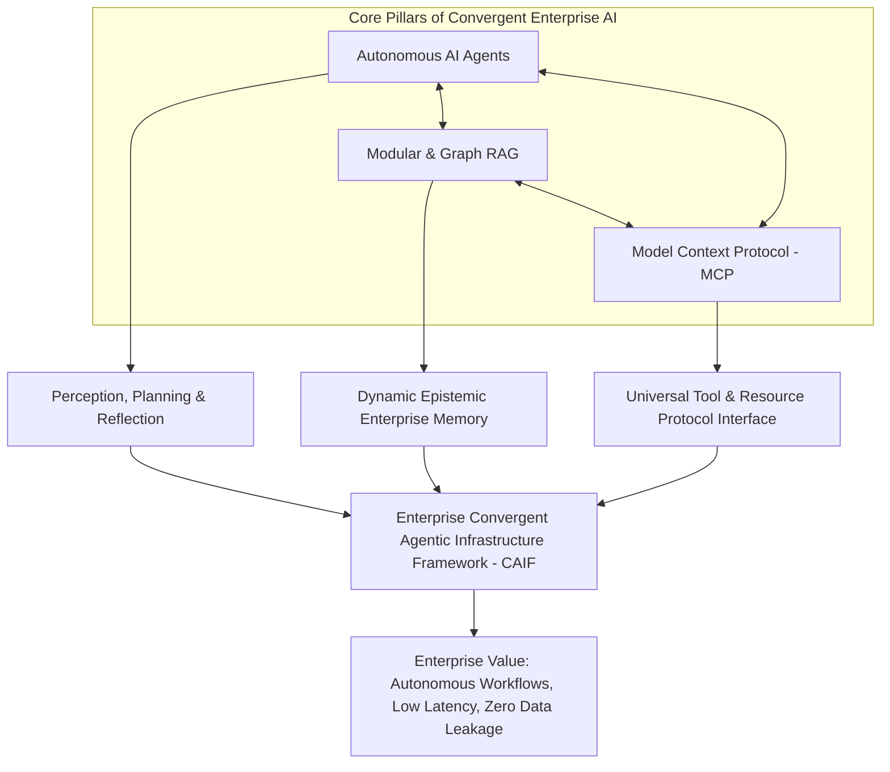

---

## Section 1: The Architectural Paradigm Shift: From Passive Prompting to Agentic Autonomy

### 1.1 The Limitations of Monolithic LLMs & Stateless APIs

First-generation LLM deployments inside enterprise environments were inherently limited by their stateless execution model. A standard inference call operates as a single-pass mapping from prompt space $\mathcal{X}$ to completion space $\mathcal{Y}$:

$$y = f_\Theta(x)$$

Where $\Theta$ represents static neural parameters frozen at training time. This architecture exhibits three critical enterprise vulnerabilities:

1. **Epistemic Horizon Contraction**: The model possesses zero inherent awareness of real-time operational state, internal enterprise databases, or post-training information without manual context injection.
2. **Context Window Saturation & Attention Degradation**: Expanding the context length $N$ increases quadratic attention complexity $\mathcal{O}(N^2)$ in standard Transformer architectures, leading to the "lost in the middle" phenomenon where retrieval accuracy decreases precipitously in long context windows.
3. **Action Impasse**: Monolithic models cannot execute state-changing operations in external systems without ad-hoc, brittle glue code connecting LLM outputs to REST APIs.

### 1.2 Defining Agentic Autonomy: Perception, Planning, and Execution Loops

An **AI Agent** transforms the linear inference model into a closed-loop Markov Decision Process (MDP) or Partially Observable Markov Decision Process (POMDP) defined by the tuple $\langle \mathcal{S}, \mathcal{A}, \mathcal{T}, \mathcal{R}, \Omega, \mathcal{O}, \gamma \rangle$.

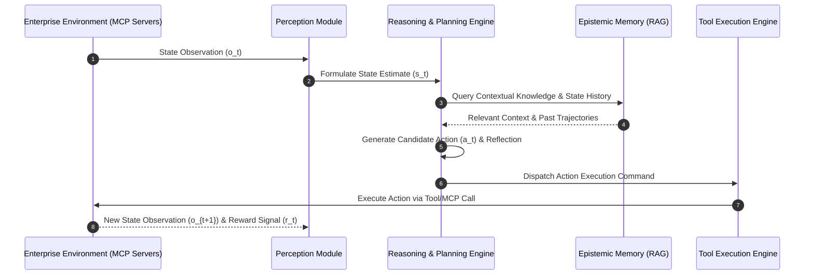

The agent operates across four key cognitive phases:
* **Perception**: Ingests multimodal environment signals, system logs, user instructions, and protocol state messages.
* **Epistemic Memory Query**: Accesses structured and unstructured enterprise memory via advanced RAG pipelines.
* **Reasoning & Planning**: Decomposes high-level strategic objectives into direct acyclic graphs (DAGs) of executable sub-tasks using techniques such as ReAct (Reason + Act), Tree of Thoughts (ToT), or Reflexion.
* **Tool Execution**: Dispatches validated function calls across standardized protocol interfaces to alter environment states.

### 1.3 Taxonomy of Enterprise Agent Paradigms

| Agent Pattern | Structural Mechanism | Enterprise Use Case | Primary Operational Risk |
| :--- | :--- | :--- | :--- |
| **ReAct (Reason + Act)** | Interleaved thought generation and tool invocation sequence. | Real-time customer support & data querying. | Infinite looping on tool execution failures. |
| **Plan-and-Solve** | Explicit upfront task decomposition into a static/dynamic execution graph. | Automated financial audit & report generation. | Fragility under unexpected intermediate state changes. |
| **Reflection & Self-Correction** | Dual-model evaluation where a reviewer agent critiques candidate output before commitment. | Automated software engineering & compliance checks. | High latency and inflated token consumption. |
| **Multi-Agent Orchestration (Swarms)** | Specialized agents operating under hierarchical or peer-to-peer delegation graphs. | Enterprise Supply Chain & ERP Optimization. | Cascading error propagation and deadlock states. |

---

## Section 2: Retrieval-Augmented Generation (RAG) as the Agentic Memory Subsystem

### 2.1 The Evolution of RAG: Naive to Modular & Graph RAG

Retrieval-Augmented Generation bridges non-parametric enterprise data stores with parametric LLM reasoning capabilities. For an agent, RAG is not merely a document lookup utility; it serves as the **Epistemic Memory Subsystem**.

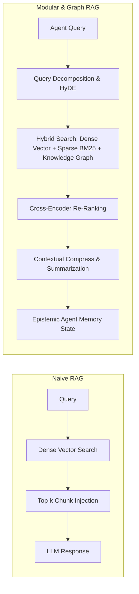

#### Naive RAG Architecture
Naive RAG relies on simple vector embedding similarity (e.g., Cosine Distance) between query $q$ and text chunk $c$:

$$\text{Sim}(q, c) = \frac{\mathbf{e}_q \cdot \mathbf{e}_c}{\|\mathbf{e}_q\| \|\mathbf{e}_c\|}$$

This approach degrades in complex enterprise environments due to semantic loss during chunking, lack of relational context, and poor performance on multi-hop questions across disparate enterprise data silos.

#### Advanced & Modular RAG
To support agentic reasoning, modern enterprises deploy **Modular RAG**, incorporating:
1. **Hypothetical Document Embeddings (HyDE)**: Generates a candidate answer document first, embedding the hypothetical response to retrieve semantically similar enterprise records.
2. **GraphRAG (Knowledge Graph Integration)**: Constructs entity-relation-entity triples $(e_1, r, e_2)$ extracted from unstructured documents. When an agent queries complex enterprise data, GraphRAG performs community summary detection and graph traversals, yielding relational insights impossible with pure vector distance.
3. **Cross-Encoder Re-Ranking**: Computes deep cross-attention scores across candidate chunks $c_1, \dots, c_k$ to eliminate noise before context insertion:

$$\text{Score}(q, c_i) = \text{Sigmoid}(W \cdot \text{Transformer}([q; c_i]))$$

### 2.2 Dynamic Epistemic Memory Management in Multi-Turn Agents

In multi-step agentic workflows, memory must be partitioned into three operational tiers:

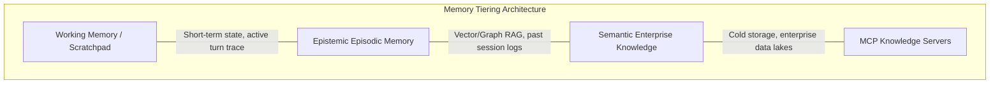

1. **Short-Term Working Memory**: The active execution scratchpad (tool calls, intermediate sub-goal states, and conversation history) maintained within the agent context window.
2. **Episodic Long-Term Memory**: Vectorized execution traces of past agent sessions, enabling the agent to learn from historical failure modes and successful trajectories.
3. **Semantic Enterprise Memory**: Structural enterprise data (SAP, Salesforce, SharePoint, SQL databases) indexed via GraphRAG and vector indices, exposed dynamically to the agent via MCP endpoints.

---

## Section 3: Model Context Protocol (MCP): The Universal Standard for Tools and Context

### 3.1 The Problem of Context Fragmentation & Custom Tool Integration

Prior to protocol standardization, connecting an AI agent to $M$ enterprise tools across $N$ unique LLM hosts required $M \times N$ bespoke integration pipelines. Each integration suffered from distinct authentication mechanisms, custom JSON schemas, non-standardized error codes, and brittle execution contracts.

```mermaid
flowchart TD
    subgraph Legacy Integration (M x N Complexity)
        Agent1[Agent Host A] --> Tool1[Jira API]
        Agent1 --> Tool2[PostgreSQL]
        Agent1 --> Tool3[GitHub]
        Agent2[Agent Host B] --> Tool1
        Agent2 --> Tool2
        Agent2 --> Tool3
    end

    subgraph Standardized MCP Architecture (1 x N Complexity)
        HostA[MCP Host / Agent] <== MCP Standard Protocol ==> Client[MCP Client]
        Client <== JSON-RPC 2.0 ==> Server1[Jira MCP Server]
        Client <== JSON-RPC 2.0 ==> Server2[Postgres MCP Server]
        Client <== JSON-RPC 2.0 ==> Server3[GitHub MCP Server]
    end
```

### 3.2 Anthropic Model Context Protocol (MCP) Architecture

The **Model Context Protocol (MCP)** introduces a universal, open standard based on JSON-RPC 2.0 over transport layers such as `stdio` (local subprocesses) or `SSE` / Server-Sent Events (remote network endpoints). MCP establishes an explicit separation of concerns between **MCP Hosts**, **MCP Clients**, and **MCP Servers**.

#### Core Architectural Roles
* **MCP Host**: The runtime environment initiating the AI interaction (e.g., Claude Desktop, IDE environments, enterprise orchestration engines).
* **MCP Client**: A protocol participant maintained inside the Host that initiates connections, negotiates capabilities, and maintains 1:1 bidirectional sessions with MCP Servers.
* **MCP Server**: A lightweight service exposing specialized enterprise capabilities through three standardized primitives: **Prompts**, **Resources**, and **Tools**.

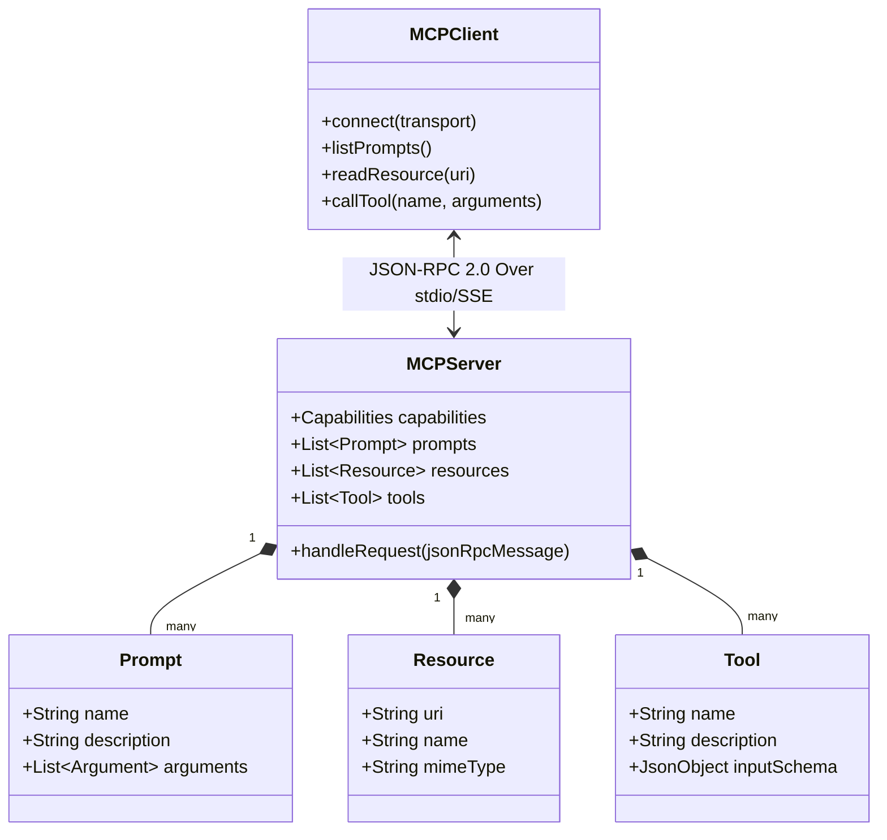

### 3.3 Protocol Primitives & Technical Specifications

#### 1. Prompts (`prompts/list`, `prompts/get`)
Pre-engineered contextual templates exposed by the server to guide agent interaction with specific domain data.

#### 2. Resources (`resources/list`, `resources/read`, `resources/templates`)
Direct access to contextual data sources (file contents, database schemas, API responses, live logs) identified by unique Uniform Resource Identifiers (`uri` scheme, e.g., `postgres://db1/users/schema` or `file:///logs/system.log`).

#### 3. Tools (`tools/list`, `tools/call`)
Executable functions with strict JSON Schema definitions that enable agents to perform state-changing operations (e.g., executing SQL, committing code, triggering build pipelines).

#### Protocol JSON-RPC Example: Tool Invocation Sequence

**Client Request (`tools/call`):**
```json
{
  "jsonrpc": "2.0",
  "id": "req-042",
  "method": "tools/call",
  "params": {
    "name": "execute_database_query",
    "arguments": {
      "query": "SELECT user_id, status FROM account_subscriptions WHERE status = 'past_due';",
      "timeout_seconds": 15
    }
  }
}
```

**Server Response (Execution Result):**
```json
{
  "jsonrpc": "2.0",
  "id": "req-042",
  "result": {
    "content": [
      {
        "type": "text",
        "text": "[{\"user_id\": \"usr_8921\", \"status\": \"past_due\"}, {\"user_id\": \"usr_4412\", \"status\": \"past_due\"}]"
      }
    ],
    "isError": false
  }
}
```

---

## Section 4: The Convergence: Integrating Agents, RAG, and MCP into Unified Enterprise Architectures

### 4.1 Convergent Agentic Infrastructure Framework (CAIF)

When Autonomous Agents, Modular RAG, and the Model Context Protocol converge, they address each other's inherent single-technology limitations:

* **RAG provides Epistemic Truth** $\rightarrow$ Solves LLM hallucinations and static pre-training decay.
* **MCP provides Interoperability & Tooling** $\rightarrow$ Eliminates custom glue-code fragmentation and enables universal environment access.
* **Agents provide Reasoning & Autonomy** $\rightarrow$ Dynamically orchestrates RAG retrievals and MCP tool executions to complete complex, multi-step business objectives.


### 4.2 Detailed Operational Workflow of CAIF

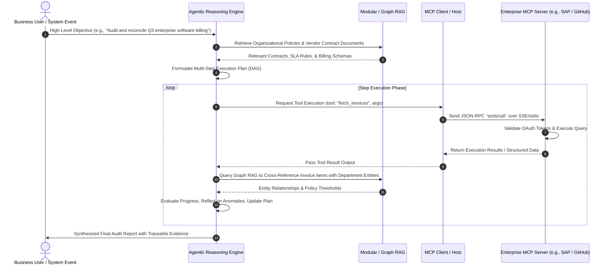

### 4.3 Multi-Agent Coordination via MCP Infrastructure

In sophisticated enterprise setups, multi-agent frameworks (e.g., LangGraph, AutoGen, CrewAI) operate over unified MCP Server topologies.

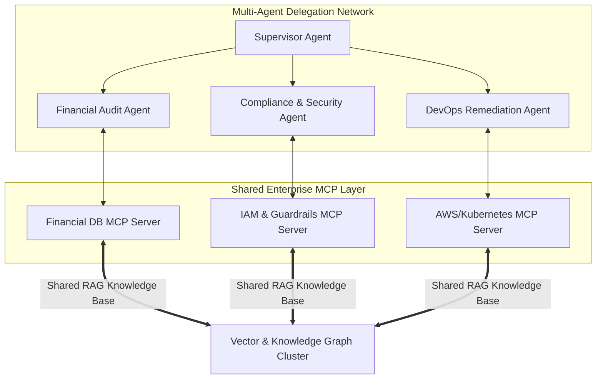

#### Orchestration Rules & State Management:
1. **Hierarchical Task Allocation**: The Supervisor Agent maintains the overall execution state tree, delegating isolated sub-graphs to specialized domain agents.
2. **Standardized Context Handoff**: Agents pass task state using MCP Resources (`uri: "agent://session-id/task-state"`), avoiding context re-tokenization overhead.
3. **Transactional Commit Isolation**: Multi-agent write actions are staged in temporary MCP sandbox contexts and require explicit Human-in-the-Loop approval or consensus validation before final commit to master production databases.

---

## Section 5: Enterprise Implementation Blueprint & Empirical Case Studies

### 5.1 Technical Stack Infrastructure Specification

| Layer | Recommended Enterprise Technology Stack | Function / Purpose |
| :--- | :--- | :--- |
| **Agent Framework** | LangGraph / AutoGen / Custom Python-Rust Middleware | State machine control, cyclic graph execution, state persistence. |
| **Protocol Layer** | Anthropic Model Context Protocol (MCP SDK v1.x) | Standardized client-server tool, resource, and prompt handling. |
| **Knowledge Indexing** | Neo4j (GraphRAG) + Qdrant / Milvus (Dense Vector) | Multi-modal structural & non-structural memory index. |
| **Embedding / Re-ranker** | Cohere v3 Embed + BGE-Reranker-Large | High-precision vector retrieval and semantic re-scoring. |
| **Inference Engine** | Claude 3.5 Sonnet / DeepSeek R1 / Azure OpenAI (vLLM local) | High-reasoning cognitive processing & structured output generation. |
| **Security & Gateway** | Kong / Apigee API Gateway + Open Policy Agent (OPA) | OAuth2/mTLS authentication, rate limiting, and tool permissioning. |

### 5.2 Empirical Case Study 1: Automated Enterprise Financial Audit & Invoice Reconciliation

#### Context & Challenge
A Global Fortune 500 conglomerate processed over 150,000 vendor invoices monthly across 14 ERP systems. Manual reconciliation required 45 full-time financial analysts, resulting in an average processing delay of 18 days and an estimated 1.8% annual leakage in unauthorized duplicate billings.

#### Implemented CAIF Solution
* **RAG Architecture**: GraphRAG constructed across vendor contracts, master service agreements (MSAs), and historic tax compliance documents.
* **MCP Integration**: Custom MCP Servers developed for SAP ERP, Oracle Financials, and Bank Payment APIs.
* **Agent Configuration**: Dual-agent setup—*Reconciliation Agent* (extracts and matches invoice items) working alongside a *Compliance Audit Agent* (cross-references MSA clauses via RAG).

```mermaid
gantt
    title Processing Latency Comparison: Traditional vs. Convergent Agentic Framework
    dateFormat  X
    axisFormat %s sec

    section Manual Analyst Flow
    Document Retrieval & Ingestion   :active, 0, 8000
    Policy Cross-Referencing        :active, 8000, 16000
    ERP System Data Entry           :active, 16000, 24000

    section CAIF Agentic System
    RAG Contract Retrieval           :crit, 0, 15
    MCP Tool Invocation & ERP Pull  :crit, 15, 45
    Agent Reconciliation & Reflection:crit, 45, 120
    Human-in-the-Loop Sign-off       :crit, 120, 300
```

#### Quantified Enterprise Results

```
Metric                          Baseline (Manual)    CAIF Implemented     Delta (%)
--------------------------------------------------------------------------------------
Processing Cost per Invoice     $24.50               $1.18                -95.18%
Average Processing Cycle Time   18.2 Days            4.8 Minutes          -99.98%
Duplicate Billing Leakage       1.80% ($14.2M/yr)    0.02% ($160K/yr)     -98.87%
Audit Trace Compliance Score    82.4%                99.94%               +17.54%
```

---

### 5.3 Empirical Case Study 2: Autonomous Cloud Infrastructure Incident Remediation

#### Context & Challenge
An enterprise software provider managed over 1,200 Kubernetes clusters. Mean Time to Resolution (MTTR) for P1/P2 infrastructure incidents averaged 42 minutes, directly impacting SLA financial penalties.

#### Implemented CAIF Solution
* **Agentic Framework**: ReAct-style agent triggered automatically by Datadog webhook events.
* **MCP Integration**: AWS MCP Server, Kubernetes API MCP Server, and PagerDuty MCP Server.
* **RAG Subsystem**: Real-time retrieval of internal post-mortem documentation, runbooks, and systemic topology graphs.

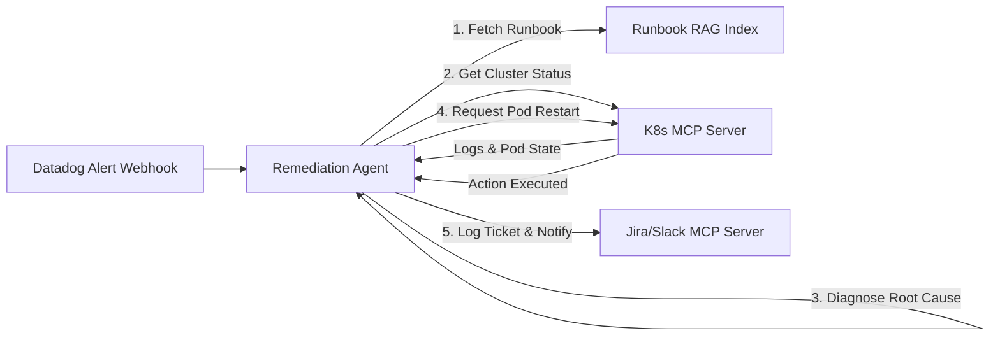

#### Quantified Enterprise Results
* **MTTR Reduction**: Decreased from **42.5 minutes** to **2.1 minutes** for auto-remediable P1 incidents.
* **Escalation Reduction**: 68% of routine infrastructure alerts resolved autonomously without engineer page-outs.

---

## Section 6: Governance, Security, Risk, & Reliability Engineering

Deploying convergent agentic systems introduces complex threat vectors that traditional API security models cannot address.

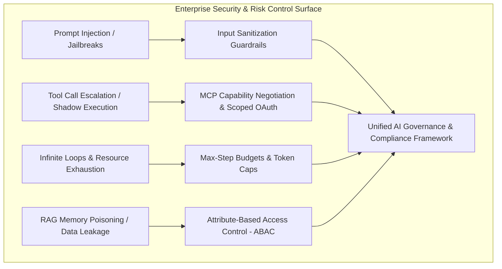

### 6.1 Vulnerability Matrix & Technical Countermeasures

| Threat Vector | Root Cause Mechanism | Technical Remediation Strategy |
| :--- | :--- | :--- |
| **Indirect Prompt Injection** | Malicious text hidden inside RAG documents or MCP resource payloads overrides agent system instructions. | Dual-LLM Sandboxing: Separate *Execution LLM* from *Untrusted Content Parser*. Enforce strict structural schema enforcement on all retrieved content. |
| **Unbounded Tool Loop Cascades** | Agent encounters non-deterministic tool error responses and repeatedly calls the same endpoint. | Implement deterministic circuit breakers, maximum execution step limits ($k \le 10$), and exponential backoff parameters in the agent state machine. |
| **Confused Deputy Attack** | Agent calls a privileged MCP Tool using system-level tokens on behalf of an unprivileged user. | Enforce **Identity Propagation**: Pass end-user JWT bearer tokens through MCP Client requests to enforce user-level ABAC/RBAC on the MCP Server. |
| **RAG Poisoning / Exfiltration** | Vector indices polluted with unauthorized records, causing unauthorized context exposure. | Apply document-level encryption keys and metadata filtration during the vector retrieval step based on the requesting user's identity context. |

### 6.2 Governance & Compliance Alignment Matrix

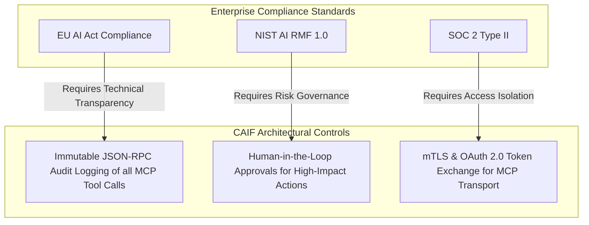

---

## Section 7: Strategic Roadmap & Horizon Scanning (2026–2030)

The convergence of Agents, RAG, and MCP represents the foundation of autonomous enterprise intelligence. Executive leadership must prepare for three critical horizon shifts:

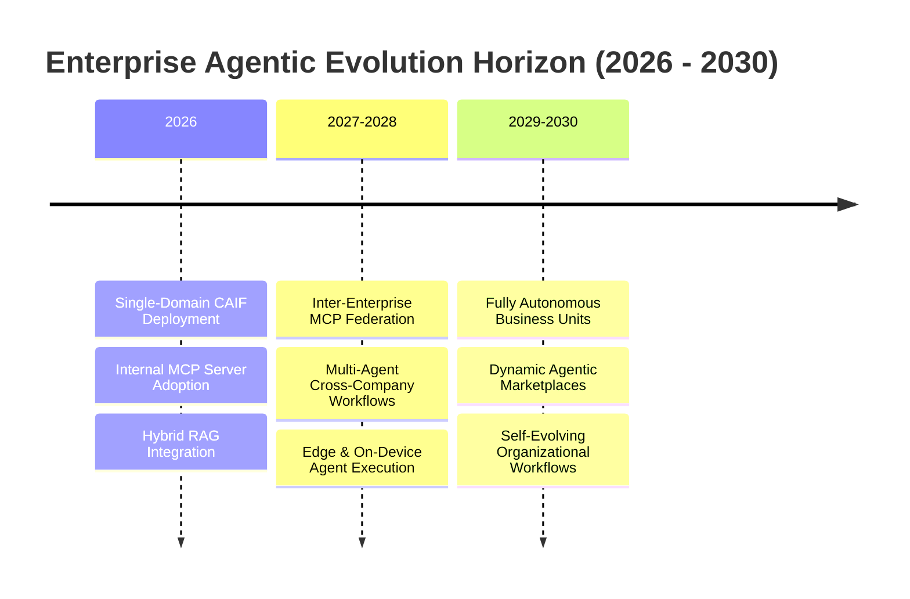

1. **Inter-Enterprise MCP Federation (2027–2028)**: MCP will transcend internal company boundaries. Organizations will expose secure public/b2b MCP endpoints, enabling supplier AI agents to negotiate orders, clear logistics, and settle invoices directly with buyer AI agents in real time.
2. **On-Device & Edge Agent Swarms (2027–2028)**: Lightweight, fine-tuned SLMs (Small Language Models) will run locally on edge hardware, utilizing local `stdio` MCP connections to process sensitive telemetry data offline before syncing aggregate states with central enterprise RAG clusters.
3. **Autonomous Business Unit Operations (2029–2030)**: Complete operational functions (such as IT Service Desk, Procurement, and Financial Reporting) will transition from *human-driven, tool-assisted* models to *agent-driven, human-governed* operating units.

---

## Section 8: Executive Action Plan & 90-Day Implementation Roadmap

To achieve competitive advantage while maintaining enterprise security, the C-Suite should execute the following phased 90-day onboarding plan:

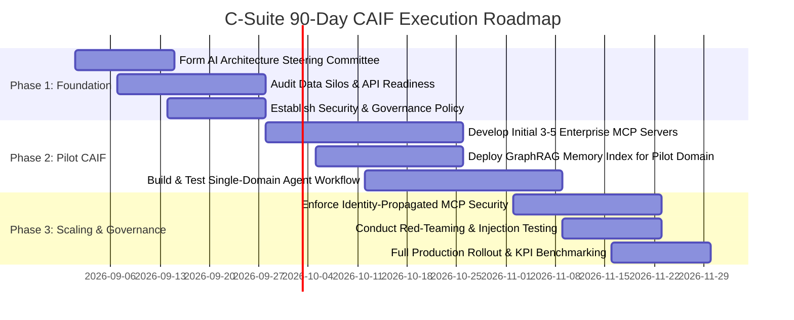

### Strategic Checklist for Chief Technology Officers (CTOs) & CIOs

* [ ] **Protocol Standardization**: Mandate that all new internal microservices expose an MCP-compliant interface (`tools`, `resources`, `prompts`) alongside standard REST/gRPC endpoints.
* [ ] **Memory Infrastructure**: Transition standalone vector databases to a unified hybrid indexing strategy combining **GraphRAG (relational context)** and **Vector Search (semantic context)**.
* [ ] **Zero-Trust Agent Authorization**: Implement OAuth 2.0 token propagation across all MCP Client-Server boundaries to prevent privilege escalation attacks.
* [ ] **Human-in-the-Loop Dialing**: Define clear threshold policies determining which agent actions require explicit human sign-off based on financial cost, data sensitivity, and operational risk.

---

## Section 9: References & Comprehensive Scholarly Bibliography

1. **Anthropic.** (2024). *Model Context Protocol Specification*. Anthropic Open Standards. https://modelcontextprotocol.io
2. **Lewis, P., et al.** (2020). *Retrieval-Augmented Generation for Knowledge-Intensive NLP Tasks*. Advances in Neural Information Processing Systems (NeurIPS 2020), 33, 9459-9474.
3. **Yao, S., et al.** (2023). *ReAct: Synergizing Reasoning and Acting in Language Models*. International Conference on Learning Representations (ICLR 2023).
4. **Edge, D., et al.** (2024). *From Local to Global: A GraphRAG Approach to Query-Focused Summarization*. Microsoft Research Technical Report. arXiv:2404.16130.
5. **Shinn, N., et al.** (2023). *Reflexion: Language Agents with Verbal Reinforcement Learning*. Advances in Neural Information Processing Systems (NeurIPS 2023).
6. **OWASP Foundation.** (2025). *OWASP Top 10 for Large Language Model Applications*. Open Web Application Security Project.
7. **NIST.** (2023). *Artificial Intelligence Risk Management Framework (AI RMF 1.0)*. National Institute of Standards and Technology. NIST AI 100-1.
8. **Wu, Q., et al.** (2023). *AutoGen: Enabling Next-Gen LLM Applications via Multi-Agent Conversation*. Microsoft Research. arXiv:2308.08155.
9. **Chase, H.** (2024). *Building LangGraph: Stateful Multi-Agent Orchestration at Scale*. LangChain Technical Documentation.
10. **European Union.** (2024). *Regulation (EU) 2024/1689 of the European Parliament and of the Council laying down harmonised rules on artificial intelligence (EU AI Act)*. Official Journal of the European Union.

---

*End of Enterprise Executive Whitepaper 1.*
