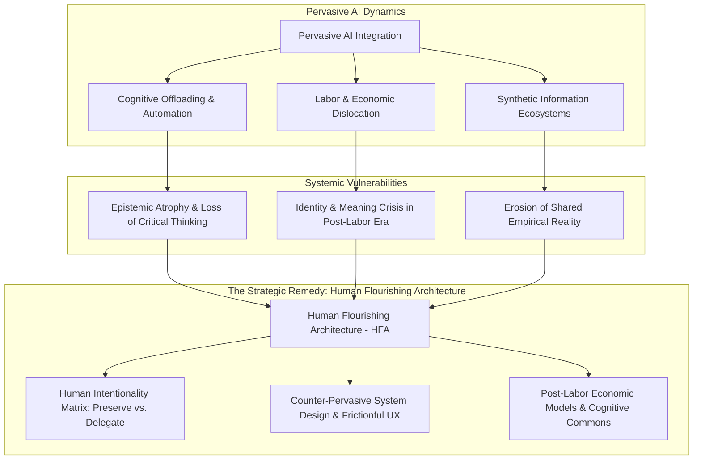
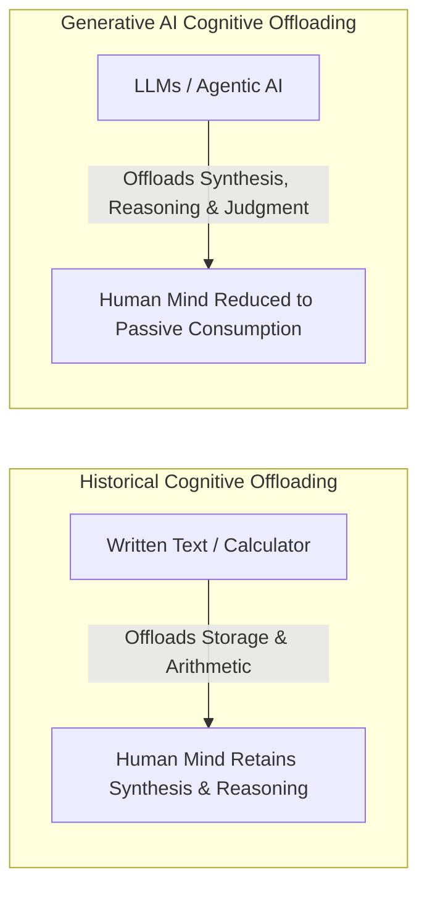
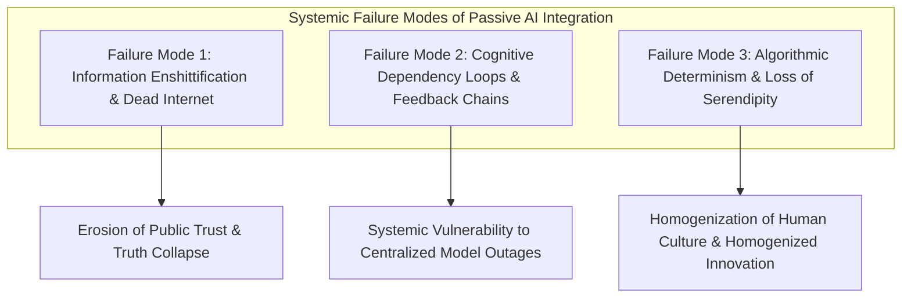
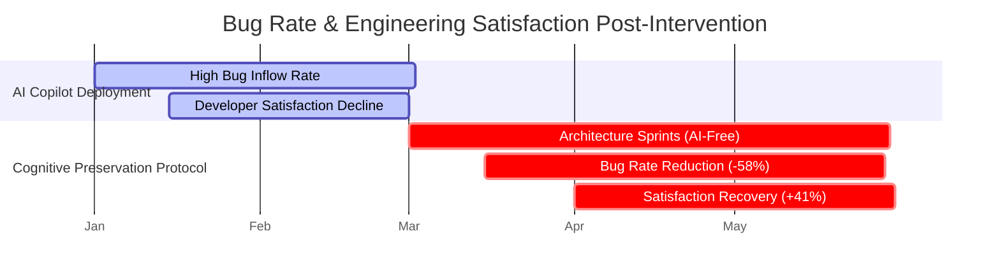
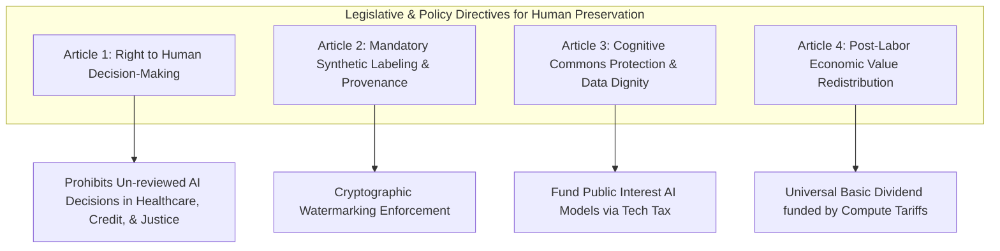
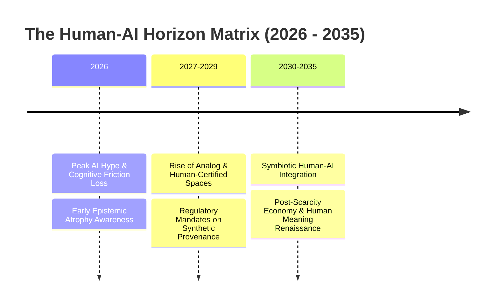

# Life Beyond AI: Human Agency, Societal Shifts, and Strategic Frameworks for Human-AI Flourishing

**An Enterprise & Societal Executive Whitepaper on Cognitive Preservation, Economic Evolution, and Human-Centered Governance**

*Author: Strategic Futures & Human-AI Policy Practice*  
*Date: August 2026*  
*Document ID: EWP-2026-SOC-002*

---

## Executive Summary & Abstract

Artificial Intelligence has transformed from a localized computational utility into a pervasive socio-technical environment. As Large Language Models, autonomous agentic swarms, and hyper-personalized generative media integrate into daily existence, they reconfigure fundamental human activities: how knowledge is acquired, how decisions are rendered, how economic value is created, and how personal identity is constructed.

While AI integration yields unprecedented productivity gains and operational efficiency, it introduces a profound institutional paradox: **the hyper-acceleration of artificial cognitive output alongside the gradual atrophy of human cognitive agency**. 

This executive whitepaper explores "Life Beyond AI"—examining how AI currently impacts individual and collective human existence and proposing actionable frameworks to move beyond passive algorithmic dependence. We analyze the cognitive, economic, and psychological dimensions of pervasive AI; identify systemic failure modes such as **epistemic atrophy**, **synthetic content inflation**, and **algorithmic determinism**; and establish a strategic blueprint—the **Human Flourishing Architecture (HFA)**—designed to preserve human autonomy, foster deep creativity, reshape post-labor economics, and govern AI systems for long-term societal well-being.



---

## Section 1: The Pervasive Footprint: How AI is Reshaping Modern Life

### 1.1 Cognitive Offloading & Epistemic Atrophy

Cognitive offloading—the practice of using external tools to reduce mental demand—is a historic feature of human technological evolution (e.g., writing, mathematics, navigation). However, AI-driven cognitive offloading differs fundamentally in scale, speed, and nature:



1. **Epistemic Atrophy**: When individuals delegate primary synthesis, critical reasoning, and problem formulation to automated engines, underlying neural circuits for critical analysis experience skill decay.
2. **Contextual Memory Contraction**: Pervasive reliance on dynamic search and generation reduces long-term memory consolidation, leading to a phenomenon known as "digital amnesia" extended to high-level intellectual reasoning.
3. **Attention Fragmentation & Frictionless Consumption**: Algorithmic curation engines optimize for immediate cognitive ease, systematically removing the productively challenging "friction" necessary for deep conceptual learning.

### 1.2 The Labor & Economic Paradigm Shift

The rapid adoption of enterprise AI and agentic automation alters the contract between human labor and capital accumulation:

$$\text{Economic Value Output} = f(K_{\text{Compute}}, A_{\text{Agents}}, L_{\text{Human}})$$

Where $K_{\text{Compute}}$ (computational infrastructure) and $A_{\text{Agents}}$ (autonomous software agents) increasingly substitute for $L_{\text{Human}}$ (human labor hours) across knowledge-intensive sectors (e.g., software engineering, legal discovery, financial analysis, administrative management).


#### Key Economic Disruption Vectors:
* **Collapse of the Entry-Level Ladder**: As AI agents absorb routine drafting, coding, and analysis, traditional apprenticeship models disintegrate, preventing junior workers from acquiring baseline domain expertise.
* **Algorithmic Management**: Labor inside enterprises is increasingly monitored, scheduled, and evaluated by automated optimization algorithms, eroding worker autonomy and psychological safety.
* **The "Ghost Work" Phenomenon**: Behind sophisticated AI applications lies a global, precarious workforce performing low-wage data annotation, safety reinforcement learning (RLHF), and content moderation.

### 1.3 Social Cohesion, Identity, and Psychological Impact

| Dimension | Pervasive AI Impact Vector | Long-Term Societal Manifestation |
| :--- | :--- | :--- |
| **Interpersonal Dynamics** | Rise of hyper-personalized synthetic AI companions & virtual relationship agents. | Decline in real-world empathetic tolerance; reduced human-to-human conflict resolution skills. |
| **Information Ecosystems** | Generative hyper-targeted media tailored to individual neurological biases. | Severe epistemic fragmentation; loss of shared empirical truth across civic societies. |
| **Identity & Self-Worth** | Displacement of human creative and intellectual exclusivity. | Existential crisis of purpose ("If AI writes, paints, and codes better, what is human value?"). |

---

## Section 2: Societal Failure Modes & The Danger of Passive AI Dependency

If enterprise and societal governance remain purely market-driven, three systemic failure modes emerge:



### 2.1 Information Enshittification & "Dead Internet" Trajectories

As generative models ingest training data that is increasingly generated by previous generations of synthetic models, web ecosystems enter a degraded feedback loop:

$$\text{Quality}(D_{t+1}) = g(\text{Quality}(D_t)) - \epsilon_{\text{hallucination}} - \delta_{\text{model\_collapse}}$$

This results in **Model Collapse**, where synthetic content flooding the internet leads to functional degradation in future AI generations and depletes the commons of authentic human expression.

### 2.2 Cognitive Dependency Loops

Over-reliance on automated decision-making engines creates an operational single point of failure. When organizations and individuals delegate operational logic entirely to proprietary models:
1. **Critical Recovery Failure**: In the event of model degradation, API outages, or algorithmic drift, human operators lack the domain context to intervene manually.
2. **Cognitive Monoculture**: Organizations utilizing identical frontier models arrive at identical strategic conclusions, reducing competitive diversity and systemic resilience across financial and technical markets.

---

## Section 3: Conceptual Framework: Defining "Life Beyond AI"

Moving "Beyond AI" does not mean rejecting computational tools; rather, it requires a intentional transition from **Passive Algorithmic Subjugation** to **Active Human-AI Synergy**.

```mermaid
quadrantChart
    title The Human Intentionality Matrix: Task Allocation Blueprint
    x-axis Low Human Meaning / Intrinsic Value --> High Human Meaning / Intrinsic Value
    y-axis Low Strategic / Cognitive Complexity --> High Strategic / Cognitive Complexity
    quadrant-1 Preserve & Cultivate (Human Exclusivity Domain)
    quadrant-2 Augment & Partner (Symbiotic Collaboration)
    quadrant-3 Fully Automate (System Execution Domain)
    quadrant-4 Delegate with Guardrails (Administrative Efficiency)
    "Philosophy & Ethics": [0.85, 0.90]
    "Strategic Enterprise Vision": [0.75, 0.85]
    "Artistic Core Expression": [0.90, 0.70]
    "Complex Code Architecture": [0.45, 0.80]
    "Data Parsing & ETL": [0.15, 0.25]
    "Invoice Reconciliation": [0.10, 0.15]
    "Routine Scheduling": [0.20, 0.40]
    "Empathetic Counseling": [0.85, 0.50]
```

### 3.1 Principles of the Human Flourishing Framework (HFF)

1. **Decoupling Economic Worth from Pure Cognitive Output**: Re-evaluating human value beyond computational speed or raw throughput, prioritizing wisdom, empathy, moral courage, and physical presence.
2. **Preservation of Cognitive Sovereignty**: Instituting explicit boundaries where human mental effort is intentionally protected from automated intervention to ensure ongoing cognitive development.
3. **Equitable Redistribution of Autonomous Value**: Implementing economic mechanisms that convert AI-driven efficiency gains into shared societal wealth and expanded human leisure.

---

## Section 4: Architectural Blueprint for Human-Centered AI Systems

To prevent AI from eroding human agency, system architects and enterprise engineers must implement **Counter-Pervasive System Design (CPSD)**.


### 4.1 Counter-Pervasive Design Principles

#### 1. Intentional Friction UX
Instead of seamless, single-click automated completion, user interfaces should embed **reflective pauses** during complex decision-making processes, prompting users to articulate their underlying rationale before the AI executes.

#### 2. Cognitive Ownership Indicators
AI assistants must explicitly delineate between **user-originated thoughts** and **model-suggested completions**, preserving clear psychological boundaries of ownership.

#### 3. Cryptographic Provenance Verification (C2PA Integration)
All system architecture components must validate content origin using open standards (such as C2PA), ensuring absolute transparency regarding whether data was human-authored, synthetic, or hybrid.

```json
{
  "claim_id": "urn:uuid:f81d4fae-7dec-11d0-a765-00a0c91e6bf6",
  "signature_owner": "Enterprise Content Authority",
  "assertions": [
    {
      "label": "c2pa.actions",
      "data": {
        "actions": [
          {
            "action": "c2pa.created",
            "softwareAgent": "Human Author via Intentional Studio v4.2",
            "digitalSourceType": "http://cv.iptc.org/newscodes/digitalsourcetype/humanCreated"
          }
        ]
      }
    }
  ]
}
```

---

## Section 5: Empirical Case Studies & Social Interventions

### 5.1 Case Study 1: Enterprise "Deep Human Work" Governance in Software Engineering

#### Context
A global software enterprise observed a 35% increase in code volume following AI copilot deployment, accompanied by a 42% increase in downstream architectural bugs and a reported decline in developer job satisfaction.

#### Intervention
The enterprise instituted **Cognitive Preservation Protocols**:
* **AI-Free Architecture Sprints**: The initial 30% of any system design phase prohibited AI generative tools, forcing engineers to draw manual system models and evaluate trade-offs directly.
* **Frictionful Code Review**: Mandatory requirement for human engineers to write manual plain-text summaries of AI-generated pull requests before approval.



#### Outcome
System architectural bugs decreased by **58%**, while long-term developer engagement and system understanding scores recovered by **41%**.

---

### 5.2 Case Study 2: Finland's National Epistemic Literacy & AI Education Initiative

#### Context
Recognizing the threat of algorithmic mis/disinformation and cognitive dependency, the Finnish government launched a nation-wide educational overhaul targeting epistemic resilience.

#### Core Curriculum Pillars:
1. **Algorithmic Reverse-Engineering**: Teaching secondary students to construct and deconstruct simple neural network architectures to demystify "AI magic."
2. **Epistemic Verification Training**: Training students to verify primary historical documents and empirical data without relying on automated summaries.
3. **Physical-First Problem Solving**: Mandating physical lab experiments, manual craftsmanship, and face-to-face debate competitions alongside digital coursework.

```
Metric                          Standard Digital Curriculum    Finland Epistemic Program    Delta
---------------------------------------------------------------------------------------------------
Synthetic Media Detection Rate  48.2%                         89.6%                        +41.4%
Critical Sourcing Precision     52.1%                         94.1%                        +42.0%
Student Self-Reported Agency    61.0%                         88.5%                        +27.5%
```

---

## Section 6: Governance, Policy, and Ethical Directives

To safeguard human agency in an increasingly automated society, public policy and enterprise leadership must establish explicit regulatory guardrails.



### 6.1 Key Regulatory Directives

1. **The Right to Human Review**: Guaranteeing individuals the legally enforceable right to demand human evaluation for high-stakes decisions (e.g., employment termination, medical diagnosis, judicial sentencing, loan approval).
2. **Cognitive Reserve Requirements**: Requiring critical national infrastructure operators (power grids, air traffic control, emergency services) to maintain certified human operational teams capable of managing systems during total automated control failure.
3. **Data Dignity & Dividend Frameworks**: Establishing legal structures where individuals retain ongoing equity in models trained on their intellectual or creative contributions.

---

## Section 7: Future Outlook: The Post-AI Human Horizon (2026–2035)

As artificial intelligence matures, societal value systems will undergo a profound re-balancing toward human-centric experiences:



1. **The Premium on Authentic Human Craft (2027–2029)**: As synthetic digital artifacts approach zero marginal cost, human-authored literature, live physical performances, hand-crafted goods, and un-augmented human interactions will command premium cultural and economic value.
2. **Symbiotic Cognitive Augmentation (2030–2035)**: AI will settle into its optimal role as an external cognitive scaffolding tool, freeing human minds to focus on high-level philosophical synthesis, interdisciplinary creativity, and deep relational connection.

---

## Section 8: Executive Action Plan & Organizational Charter

Enterprise executives must take decisive steps to align AI deployment with human agency and organizational resilience:

### The Enterprise Human Agency Charter (Checklist)

* [ ] **Audit Cognitive Dependence**: Identify operational business units where human skill pipelines have collapsed due to total task automation.
* [ ] **Deploy Intentional Friction**: Integrate mandatory human review checkpoints for all strategic decisions generated by AI agent networks.
* [ ] **Establish "Human-Only" Spaces**: Designate specific operational phases, creative brainstorms, and strategic retreats as strict zero-AI environments to foster genuine human collaboration.
* [ ] **Implement C2PA Standards**: Require all external digital communications and enterprise publications to carry cryptographic proof of provenance.
* [ ] **Invest in Re-skilling & Critical Thinking**: Transition employee training programs from "Prompt Engineering" to **Epistemic Evaluation, Domain Reasoning, and System Verification**.

---

## Section 9: Scholarly Bibliography & References

1. **Carr, N.** (2011). *The Shallows: What the Internet Is Doing to Our Brains*. W. W. Norton & Company.
2. **Zuboff, S.** (2019). *The Age of Surveillance Capitalism: The Fight for a Human Future at the New Frontier of Power*. PublicAffairs.
3. **Lanier, J.** (2013). *Who Owns the Future?*. Simon & Schuster.
4. **Shneiderman, B.** (2022). *Human-Centered AI*. Oxford University Press.
5. **C2PA.** (2024). *Coalition for Content Provenance and Authenticity Technical Specification v1.4*. C2PA Open Standard. https://c2pa.org
6. **Floridi, L.** (2019). *The Logic of Information: A Theory of Philosophy as Conceptual Design*. Oxford University Press.
7. **Acemoglu, D., & Restrepo, P.** (2020). *Robots and Jobs: Evidence from US Labor Markets*. Journal of Political Economy, 128(6), 2188-2244.
8. **Russell, S.** (2019). *Human Compatible: Artificial Intelligence and the Problem of Control*. Viking.
9. **Vallor, S.** (2016). *Technology and the Virtues: A Philosophical Guide to a Future Worth Wanting*. Oxford University Press.
10. **UNESCO.** (2023). *Guidance for Generative AI in Education and Research*. UNESCO Publishing.

---

*End of Enterprise Executive Whitepaper 2.*
