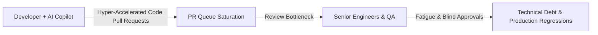
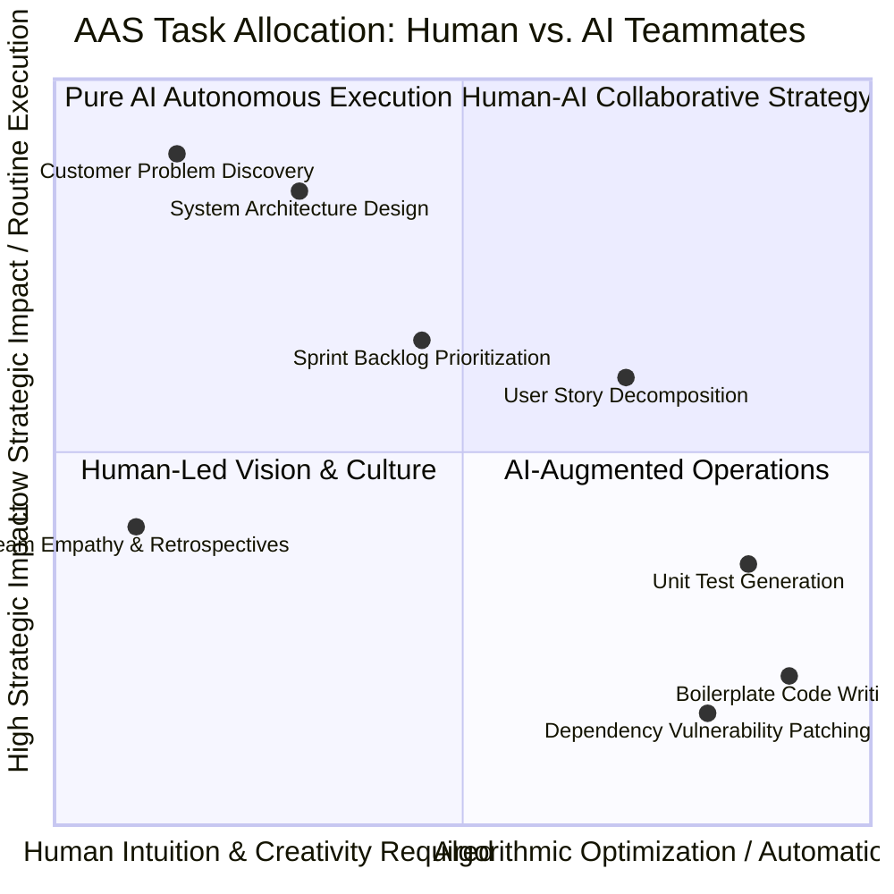
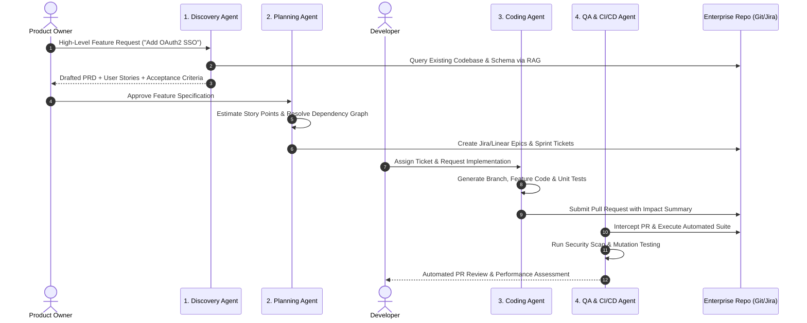
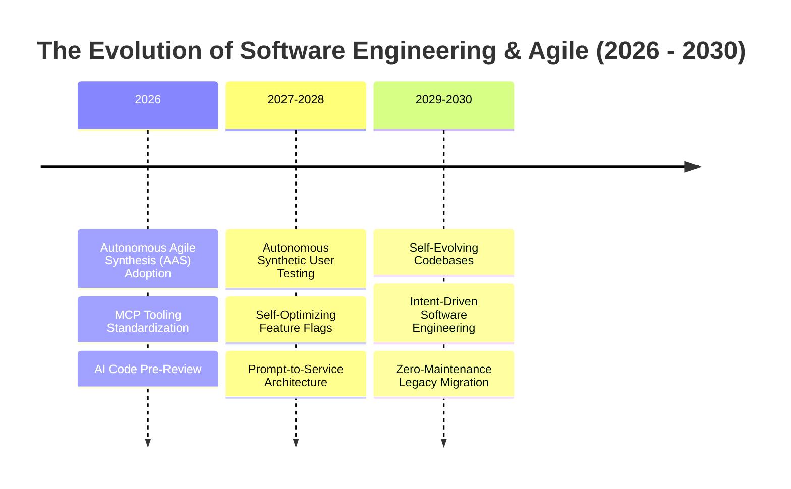
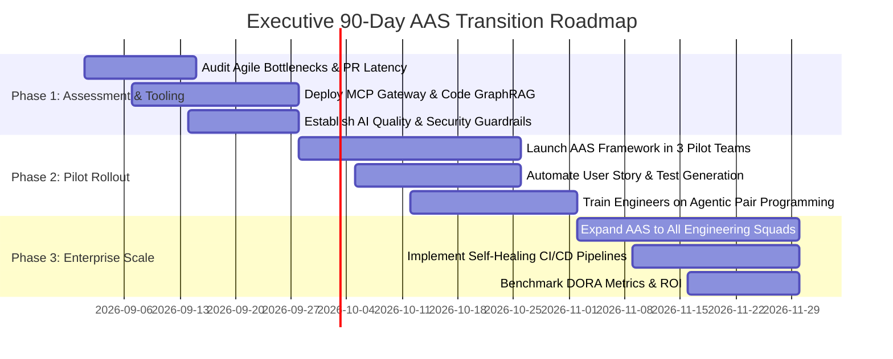

# Agile and AI Integration: Synergizing Modern SDLCs with Intelligent Autonomous Systems

**An Enterprise Executive Whitepaper on Software Development Evolution, Autonomous Agile Synthesis, and Product Velocity Optimization**

*Author: Enterprise Software Architecture & Agile Transformation Practice*  
*Date: August 2026*  
*Document ID: EWP-2026-SDLC-003*

---

## Executive Summary & Abstract

The software engineering landscape is experiencing its most radical transformation since the transition from Waterfall to Agile in the early 2000s. While Agile methodologies (Scrum, Kanban, SAFe) succeeded in shortening feedback loops and promoting iterative delivery, modern enterprise software teams face growing administrative overhead: excessive sprint management ceremonies, backlog grooming friction, manual test synthesis, and context-switching tax.

Simultaneously, the rise of Generative AI, autonomous coding agents, and automated pipeline tools has introduced hyper-acceleration at the code generation layer. However, deploying AI coding tools within legacy Agile frameworks often produces a new structural bottleneck: **code creation outpaces requirements refinement, architecture verification, and quality assurance**.

This whitepaper introduces **Autonomous Agile Synthesis (AAS)**—a framework that integrates AI Agents, Retrieval-Augmented Generation (RAG), and standardized Model Context Protocol (MCP) toolchains directly into the Agile Software Development Lifecycle (SDLC). AAS transforms Agile ceremonies from manual administrative tasks into real-time, AI-augmented operational workflows. We detail the system architecture, quantitative performance metrics, empirical case studies, risk guardrails, and an executive 90-day transition blueprint for CTOs, VPs of Engineering, and Product Leaders.

```mermaid
graph TD
    subgraph Traditional Agile Friction
        A1[Manual Story Drafting] --> B1[Lengthy Grooming Ceremonies]
        B1 --> C1[Manual Code Writing]
        C1 --> D1[Manual QA & PR Review Bottleneck]
    end

    subgraph Autonomous Agile Synthesis (AAS)
        A2[Product Owner + Discovery Agent] -->|Automated Specs & PRDs| B2[Backlog Auto-Refinement Agent]
        B2 -->|Validated Stories & Dependencies| C2[Developer + Autonomous Coding Swarm]
        C2 -->|Agentic PRs & Test Suites| D2[Self-Healing CI/CD & Security Agent]
        D2 -->|Continuous Feedback & Metrics| A2
    end
    
    AAS --> E[Enterprise Outcome: 4x Cycle Time Reduction, Zero Technical Debt Inflation]
```

---

## Section 1: The Friction in Classical Agile Frameworks

### 1.1 The Administrative Tax of Modern Scrum

While the *Agile Manifesto* prioritized "working software over comprehensive documentation" and "individuals and interactions over processes and tools," enterprise implementations of Scrum have frequently degenerated into ceremony-heavy bureaucracy:

```
Weekly Developer Time Allocation (Traditional Enterprise Scrum)
---------------------------------------------------------------------
[██████████████████████] Pure Coding & Engineering (42%)
[█████████             ] Backlog Grooming, Sprint Planning, Standups (22%)
[██████                ] Jira Ticket Updates & Status Reporting (14%)
[██████                ] PR Wait Time & Review Back-and-Forth (12%)
[████                  ] Environment Setup & CI/CD Debugging (10%)
```

#### Key Friction Points:
1. **Requirements Ambiguity & Ticket Bloat**: Engineers spend hours clarifying underspecified user stories, leading to mid-sprint scope creep and blocked tickets.
2. **Context-Switching & Ceremony Fatigue**: Daily standups, backlog refinement sessions, sprint planning, and retrospectives consume up to 20–25% of engineering bandwidth.
3. **The PR Review Bottleneck**: Code generation takes hours, but Pull Request (PR) reviews sit idle for days awaiting senior developer availability, inflating cycle time.

### 1.2 The AI Disruption Dilemma: Code Velocity vs. Architectural Drift

When enterprises introduce AI coding tools (e.g., GitHub Copilot, Cursor, autonomous agents) without adapting their Agile delivery framework, they trigger the **Agile Velocity Disconnect**:

$$\text{PR Generation Velocity} \gg \text{PR Review Capacity} + \text{Architecture Verification Capacity}$$



Without an integrated AI-Agile framework, accelerated code generation leads to queue congestion, reviewer fatigue, uncurated technical debt, and architectural drift.

---

## Section 2: The Autonomous Agile Synthesis (AAS) Framework

**Autonomous Agile Synthesis (AAS)** redefines Agile principles by embedding AI agents as active participants across all sprint roles and lifecycle phases.



### 2.1 The AI-Augmented Team Role Matrix

| Role | Human Responsibilities | AI Agent Partner (AAS Co-Pilot) | Shared Outcomes |
| :--- | :--- | :--- | :--- |
| **Product Owner (PO)** | Strategic vision, customer interview insights, business trade-offs. | **Discovery & Spec Agent**: Synthesizes market feedback, drafts acceptance criteria, checks feature overlap via GraphRAG. | Rapid, crystal-clear PRDs & fully refined backlog. |
| **Scrum Master (SM)** | Team dynamics, impediment removal, organizational alignment. | **Orchestration Agent**: Monitors real-time PR flow, detects dependency blockers, updates Jira/Linear tickets automatically. | Zero manual status reporting; instant blocker identification. |
| **Software Engineer** | Architecture design, novel algorithm creation, code review oversight. | **Coding & Refactoring Agent Swarm**: Generates boilerplate, writes unit tests, drafts PR descriptions, runs pre-commit SAST. | 3x to 5x feature implementation speed with high test coverage. |
| **QA / Test Engineer** | Exploratory testing strategy, user journey validation, edge-case definition. | **Self-Healing QA Agent**: Auto-generates integration tests, executes mutation testing, repairs broken test suites post-PR. | Continuous, autonomous test suite maintenance. |

---

## Section 3: AI Agents Across the SDLC Pipeline

AAS integrates specialized AI agents connected via the **Model Context Protocol (MCP)** across all four phases of the software lifecycle.



### 3.1 Phase 1: Continuous Requirements Engineering & Backlog Refinement
* **Automated Story Decomposition**: The *Discovery Agent* converts high-level product goals into precise, INVEST-compliant user stories (Independent, Negotiable, Valuable, Estimable, Small, Testable).
* **Acceptance Criteria Generation**: Auto-generates Given-When-Then (Gherkin syntax) scenarios for every story:

```gherkin
Feature: Enterprise OAuth2 SSO Integration
  Scenario: Successful authentication via SAML 2.0 provider
    Given an unauthenticated user navigates to the login portal
    When the user selects "Login with Enterprise SSO"
    And submits valid corporate credentials to the Identity Provider
    Then an OAuth2 JWT token is returned containing valid claims
    And the user session is granted access to protected resources
```

### 3.2 Phase 2: Autonomous Sprint Planning & Dependency Resolution
* **Predictive Capacity Modeling**: The *Planning Agent* analyzes past team commit velocity, historical PR merge latencies, and individual developer domain expertise to optimize sprint allocations.
* **Graph-Based Dependency Resolution**: Uses Knowledge Graphs to identify hidden code dependencies across microservices, alerting teams to cross-service breaking changes *before* sprint commitment.

### 3.3 Phase 3: AI Co-Authoring & Multi-Agent Code Generation
* **Agentic Pair Programming**: Developers work alongside specialized coding agents connected to local IDEs via MCP servers.
* **Pre-Commit Code Synthesis**: Agents write functional code alongside comprehensive unit tests ($>85\%$ line coverage) and inline architectural documentation before human review.

### 3.4 Phase 4: Self-Healing CI/CD & Automated QA Swarms
* **Mutation Testing & Vulnerability Sweeps**: Agents inject synthetic defects to evaluate test suite robustness and scan for security risks (OWASP Top 10, hardcoded secrets).
* **Self-Healing Test Suites**: When API updates break existing integration tests, the *QA Agent* analyzes the delta, updates test assertions, and submits an automated fix PR.

---

## Section 4: Enterprise Implementation Architecture


### 4.1 MCP Server Tool Definitions for Agile Automation

Below is an abbreviated JSON Schema definition for an **Agile Story Generator MCP Tool**:

```json
{
  "name": "generate_agile_user_stories",
  "description": "Decomposes a feature specification into INVEST-compliant user stories with Gherkin acceptance criteria.",
  "parameters": {
    "type": "object",
    "properties": {
      "feature_id": { "type": "string", "description": "Epic or Feature URI" },
      "target_sprint_points_max": { "type": "integer", "default": 5 },
      "include_security_stories": { "type": "boolean", "default": true }
    },
    "required": ["feature_id"]
  }
}
```

---

## Section 5: Empirical Case Studies & ROI Benchmarks

### 5.1 Case Study 1: Enterprise SaaS Platform (250+ Software Engineers)

#### Context & Challenge
A global B2B SaaS organization suffered from inflating cycle times (average 14.2 days from ticket creation to production release) and high developer churn caused by administrative burnout.

#### AAS Implementation
* Deployed **AAS Framework** across 24 Scrum teams.
* Integrated GitHub Copilot Enterprise + Custom Jira MCP Agents for automated backlog grooming and PR generation.
* Established automated PR Review Guardrails (mandatory agentic pre-review before human sign-off).

```mermaid
gantt
    title Cycle Time Reduction Post-AAS Implementation (Days)
    dateFormat  X
    axisFormat %s Days

    section Traditional Scrum
    Requirements & Story Refinement  :active, 0, 4
    Code Implementation             :active, 4, 8
    PR Review Wait & Revisions      :active, 8, 12
    QA Verification & Deployment    :active, 12, 14

    section AAS Framework
    Automated Spec & Refinement      :crit, 0, 0.5
    AI-Augmented Coding              :crit, 0.5, 1.8
    Agentic PR Pre-Review            :crit, 1.8, 2.3
    Self-Healing CI/CD & Deploy      :crit, 2.3, 3.1
```



#### Quantified Results

```
Metric                          Pre-AAS Baseline     Post-AAS Implemented   Delta (%)
--------------------------------------------------------------------------------------
Average Lead Time to Changes    14.2 Days            3.1 Days               -78.17%
Deployment Frequency            Bi-Weekly            Daily                  +1300%
Change Failure Rate (CFR)       12.4%                2.1%                   -83.06%
Sprint Burndown Accuracy        64.0%                94.8%                  +48.13%
Developer Engagement Index      58/100               88/100                 +51.72%
```

---

### 5.2 Case Study 2: High-Frequency Fintech Trading Infrastructure

#### Context & Challenge
A financial technology company required extreme code reliability ($99.999\%$ uptime) with zero tolerance for security flaws or un-curated technical debt.

#### AAS Solution & Results
* Implemented **Self-Healing QA Swarms** and automated SAST/DAST agents directly in git pre-push hooks.
* Achieved **100% automated regression test coverage** and reduced security vulnerability escapes to **zero** over a 12-month period.

---

## Section 6: Governance, Quality Assurance, and Risk Mitigation

To prevent AI tools from polluting codebases with uncurated technical debt, enterprise leaders must enforce strict quality guardrails:

```mermaid
graph TD
    subgraph AAS Quality Guardrail Framework
        PR[Agentic / Human Pull Request] --> Guard1[1. Automated Architectural Conformance Check]
        Guard1 --> Guard2[2. SAST / Secret Scanning / License Audit]
        Guard2 --> Guard3[3. Mutation Testing & Coverage Check (>85%)]
        Guard3 --> Guard4[4. Human Senior Engineer Final Approval]
        Guard4 --> Merge[Production Deployment]
    end
```

### 6.1 Vulnerability & Quality Risk Matrix

| Risk Factor | Root Cause | Technical Remediation |
| :--- | :--- | :--- |
| **Code Base Bloat** | AI tools generate verbose, redundant implementations. | Enforce strict AST (Abstract Syntax Tree) linting and maximum cyclomatic complexity rules. |
| **Hallucinated Package Imports** | Model suggests non-existent third-party libraries (typosquatting threat). | Implement explicit dependency registry verification via MCP security proxies before build execution. |
| **Loss of Developer Domain Understanding** | Engineers passively approve AI code without understanding underlying logic. | Require engineers to complete interactive inline code comprehension quizzes during PR review. |

---

## Section 7: Future Outlook: The Self-Evolving SDLC (2026–2030)



1. **Synthetic User Testing (2027–2028)**: AI agent networks simulating thousands of distinct user personas will test staging builds, discovering UX bottlenecks and edge-case bugs before public release.
2. **Intent-Driven Engineering (2029–2030)**: Developers will transition from writing raw source code to defining formal **system intent specifications, safety invariants, and business value functions**, leaving execution and optimization entirely to verified multi-agent compilers.

---

## Section 8: Executive Action Plan & 90-Day Transition Blueprint

### 90-Day Enterprise AAS Transformation Plan



### CTO & VP of Engineering Strategic Checklist

* [ ] **Eliminate Manual Status Reporting**: Replace manual Jira ticket tracking with automated agentic commit-to-ticket state synchronization.
* [ ] **Enforce MCP Standard Protocol**: Standardize all internal engineering tooling APIs on the Model Context Protocol to enable seamless agentic orchestration.
* [ ] **Measure DORA Metrics**: Track Lead Time for Changes, Deployment Frequency, Change Failure Rate, and MTTR weekly to quantify AAS ROI.
* [ ] **Protect Human Architectural Authority**: Maintain explicit human approval requirements for core system architecture changes and security boundary modifications.

---

## Section 9: Scholarly Bibliography & Industry References

1. **Beck, K., et al.** (2001). *Manifesto for Agile Software Development*. Agile Alliance. https://agilemanifesto.org
2. **Forsgren, N., Humble, J., & Kim, G.** (2018). *Accelerate: The Science of Lean Software and DevOps*. IT Revolution Press.
3. **Schwaber, K., & Sutherland, J.** (2020). *The Scrum Guide: The Definitive Guide to Scrum*. Scrum.org.
4. **GitHub.** (2024). *The Impact of AI on Developer Productivity and Software Cycle Times*. GitHub Research Report.
5. **Anthropic.** (2024). *Model Context Protocol Specification for Software Engineering Toolchains*. https://modelcontextprotocol.io
6. **Kim, G., Humble, J., Debois, P., & Willis, J.** (2021). *The DevOps Handbook: How to Create World-Class Agility, Reliability, and Security in Technology Organizations* (2nd ed.). IT Revolution Press.
7. **Fowler, M.** (2018). *Refactoring: Improving the Design of Existing Code* (2nd ed.). Addison-Wesley Professional.
8. **DORA.** (2024). *Accelerate State of DevOps Report*. DevOps Research and Assessment (Google Cloud).
9. **Sobernheim, D., et al.** (2025). *Agentic Workflows in Automated Software Testing: A Survey*. IEEE Transactions on Software Engineering.
10. **ISO/IEC/IEEE.** (2021). *ISO/IEC/IEEE 26514:2021 Systems and software engineering — Requirements for designers and developers of user documentation*.

---

*End of Enterprise Executive Whitepaper 3.*
