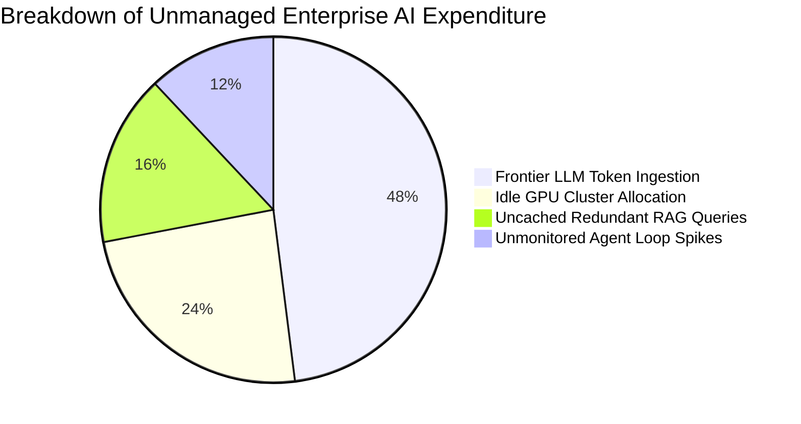
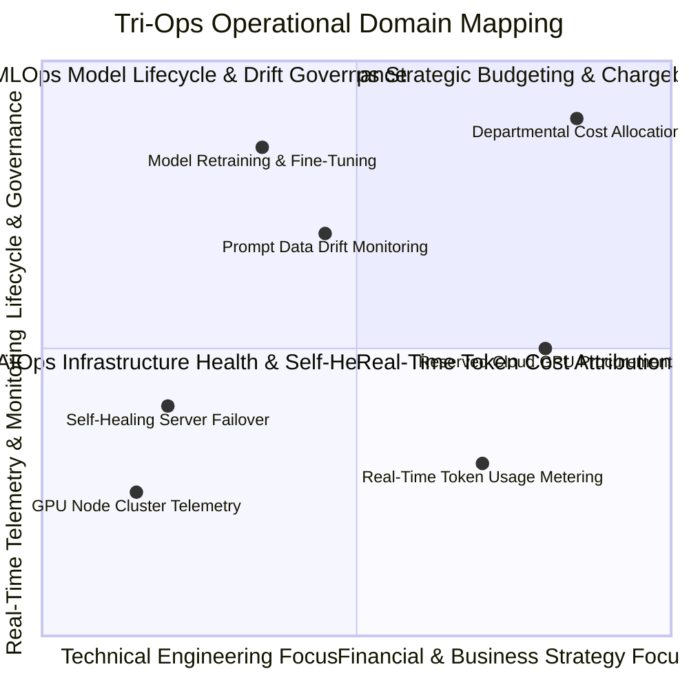
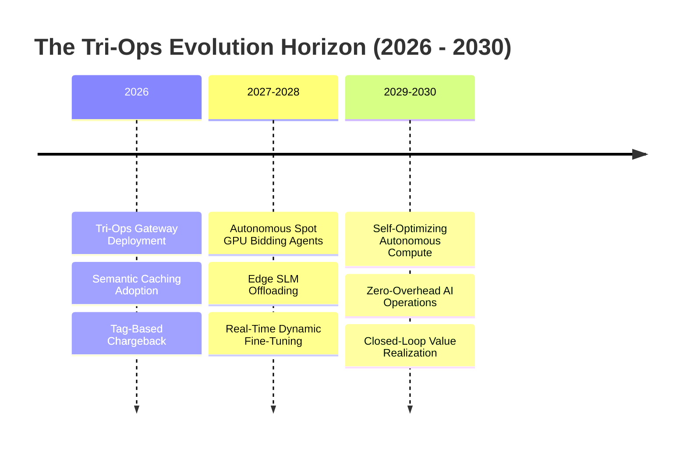
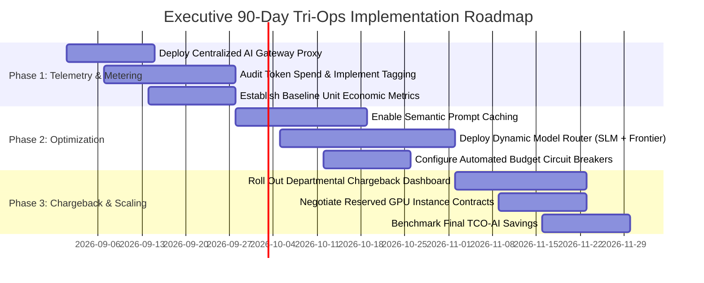

# Tri-Ops Synergy: Integrating AIOps, MLOps, and FinOps for Cost-Controlled Enterprise AI Scaling

**An Enterprise Executive Whitepaper on Token Economics, Infrastructure Telemetry, Model Governance, and Financial ROI Optimization**

*Author: Cloud Infrastructure & Financial Operations (FinOps) Practice*  
*Date: August 2026*  
*Document ID: EWP-2026-OPS-005*

---

## Executive Summary & Abstract

As enterprise artificial intelligence moves from isolated experimental pilots into mission-critical production systems, organizations face a severe structural obstacle: **runaway infrastructure costs and unpredicted token expenditures**. Enterprise AI initiatives frequently suffer from cost overruns exceeding 200–300% of initial budgetary projections, driven by inefficient model selection, un-cached prompt trajectories, unmonitored GPU instance allocation, and excessive agentic looping.

To solve this economic bottleneck, enterprises must unify three previously siloed operational disciplines:
1. **AIOps (AI for IT Operations)**: Real-time infrastructure telemetry, anomaly detection, and automated self-healing compute nodes.
2. **MLOps (Machine Learning Operations)**: End-to-end model lifecycle management, fine-tuning pipelines, evaluation benchmarking, and drift detection.
3. **FinOps (Financial Operations)**: Cloud cost transparency, unit economics modeling, real-time budget guardrails, and departmental chargeback attribution.

This executive whitepaper introduces the **Tri-Ops Synergy Framework (TOSF)**—a unified operational architecture that optimizes model quality while controlling compute expenditure. We provide token economic formulations, dynamic model routing blueprints, enterprise chargeback schemas, empirical case studies demonstrating up to 68% cost reduction, and a 90-day implementation plan for CFOs, CIOs, and VPs of Infrastructure.

```mermaid
graph TD
    subgraph Operational Silos (Legacy Enterprise)
        A1[AIOps: Infrastructure Monitoring]
        A2[MLOps: Model Deployment]
        A3[FinOps: Cloud Accounting]
    end

    subgraph The Tri-Ops Synergy Framework (TOSF)
        A1 & A2 & A3 --> B[Tri-Ops Telemetry Engine]
        B --> C[Dynamic Model & Prompt Router]
        C --> D[Semantic Cache & Context Compression]
        D --> E[Real-Time Budget Circuit Breakers]
    end

    subgraph Enterprise Outcomes
        E --> F[60-70% Reduction in AI Token Spend]
        E --> G[100% Departmental Cost Attribution]
        E --> H[Sustained High-Model Performance]
    end
```

---

## Section 1: The Economics of Enterprise AI & Token Economics

### 1.1 Total Cost of AI Operations (TCO-AI) Mathematical Formulation

The operational cost of running enterprise AI systems expands beyond raw server hosting. The **Total Cost of AI Operations (TCO-AI)** for a given operational time window $T$ is formulated as:

$$\text{TCO-AI} = \sum_{i=1}^{N} \Big( C_{\text{Inference}}(m_i) + C_{\text{Training/FT}}(m_i) + C_{\text{Infra}}(\text{GPU}_i) + C_{\text{RAG}}(\text{Vector}_i) \Big) + C_{\text{Governance}}$$

Where:
* $C_{\text{Inference}}(m_i) = \text{Tokens}_{\text{Input}} \cdot P_{\text{Input}}(m_i) + \text{Tokens}_{\text{Output}} \cdot P_{\text{Output}}(m_i)$
* $m_i$ represents the selected model tier (Frontier LLM vs. Mid-Tier vs. Small Language Model).
* $C_{\text{Infra}}(\text{GPU}_i)$ represents active GPU instance hours (e.g., NVIDIA H100/A100 cloud cluster rates).
* $C_{\text{RAG}}(\text{Vector}_i)$ represents vector indexing, embedding generation, and graph storage queries.



### 1.2 The "Cost-Per-Task" vs. "Value-Per-Task" Dilemma

A common enterprise failure mode is routing all queries—regardless of complexity—to high-cost Frontier Models (e.g., Claude 3.5 Sonnet or GPT-4o). 

| Task Complexity | Typical Enterprise Request | Optimal Model Choice | Unit Cost Differential |
| :--- | :--- | :--- | :--- |
| **Tier 1: Simple / Routine** | Sentiment classification, entity extraction, text formatting. | Fine-Tuned SLM (e.g., Llama 3 8B, Phi-3) | **1x (Baseline Cost)** |
| **Tier 2: Intermediate** | Document summarization, standard RAG retrieval, email drafting. | Mid-Tier Model (e.g., Claude 3 Haiku, GPT-4o-mini) | **10x Cost vs Tier 1** |
| **Tier 3: Complex / Reasoning** | Multi-step agentic planning, mathematical audit, code refactoring. | Frontier Model (e.g., Claude 3.5 Sonnet, DeepSeek R1) | **50x - 100x Cost vs Tier 1** |

---

## Section 2: Dissecting the Pillars: AIOps, MLOps, and FinOps



### 2.1 Pillar Breakdown

#### 1. AIOps (Infrastructure Telemetry & Self-Healing)
Focuses on the physical and virtual compute layer. AIOps monitors GPU temperature, VRAM utilization, node health, network bandwidth, and inference latency ($TFTT$ - Time to First Token). When an inference server node fails or throttles, AIOps automatically redirects traffic without dropping active agent sessions.

#### 2. MLOps (Model Lifecycle & Quality Governance)
Manages model deployment, prompt version control, fine-tuning data pipelines, and continuous evaluation (LLM-as-a-Judge). MLOps monitors **Model Drift** and **Accuracy Decay**, ensuring that cost-optimization measures do not degrade response quality below target thresholds.

#### 3. FinOps (Cloud Cost Control & Financial Accountability)
Applies financial discipline to variable cloud AI costs. FinOps establishes unit cost metrics, manages reserved instance contracts, tracks real-time token spend per department, and enforces automatic budget caps.

---

## Section 3: The Tri-Ops Synergy Framework (TOSF)

The **TOSF** integrates these three disciplines into an intelligent runtime proxy.


### 3.1 Core Cost-Reduction Technologies in TOSF

1. **Semantic Prompt Caching**: Computes vector similarity between incoming prompts and historical queries. If cosine similarity exceeds $\text{Sim}(q_{new}, q_{cached}) \ge 0.94$, the gateway returns the cached response instantly ($0$ token cost, $<10\text{ms}$ latency).
2. **Dynamic Model Routing**: Evaluates incoming query complexity using lightweight classifier models. Simple requests are routed to internal SLM clusters (costing $\approx \$0.0001/\text{1K tokens}$), while complex reasoning tasks are escalated to Frontier APIs.
3. **Context Window Compression & Summarization**: Strips redundant system prompt tokens and applies dynamic context compression before forwarding requests to commercial APIs.

---

## Section 4: Operational Automation & Code Blueprints

### 4.1 Cost-Aware Dynamic Model Router (Python Middleware)

```python
import time
import requests
from typing import Dict, Any

class TriOpsModelRouter:
    """Dynamic Cost and Complexity Router enforcing FinOps thresholds."""
    
    def __init__(self, slm_endpoint: str, frontier_endpoint: str, budget_limit_usd: float):
        self.slm_endpoint = slm_endpoint
        self.frontier_endpoint = frontier_endpoint
        self.budget_limit_usd = budget_limit_usd
        self.current_spend_usd = 0.0

    def estimate_complexity_score(self, prompt: str) -> float:
        """Lightweight heuristic scoring (0.0 = Simple, 1.0 = Highly Complex)."""
        length_score = min(len(prompt) / 2000.0, 0.4)
        reasoning_keywords = ["analyze", "refactor", "mathematical", "multi-step", "architect"]
        keyword_score = 0.5 if any(kw in prompt.lower() for kw in reasoning_keywords) else 0.0
        return length_score + keyword_score

    def route_and_execute(self, prompt: str, department_id: str) -> Dict[str, Any]:
        # 1. FinOps Budget Circuit Breaker Check
        if self.current_spend_usd >= self.budget_limit_usd:
            raise Exception("FinOps Alert: Departmental AI Budget Exceeded. Request Blocked.")
        
        complexity = self.estimate_complexity_score(prompt)
        
        # 2. Dynamic Routing Decision
        if complexity < 0.4:
            target_model = "SLM (Local Llama-3 8B)"
            target_url = self.slm_endpoint
            estimated_cost = (len(prompt) / 1000.0) * 0.0001
        else:
            target_model = "Frontier (Claude 3.5 Sonnet)"
            target_url = self.frontier_endpoint
            estimated_cost = (len(prompt) / 1000.0) * 0.003
            
        # 3. Execution & Telemetry Logging
        start_time = time.time()
        response = requests.post(target_url, json={"prompt": prompt})
        latency = time.time() - start_time
        
        self.current_spend_usd += estimated_cost
        
        return {
            "response": response.json(),
            "routed_model": target_model,
            "latency_sec": round(latency, 3),
            "cost_usd": round(estimated_cost, 6),
            "dept_id": department_id
        }
```

---

## Section 5: Empirical Case Studies & ROI Benchmarks

### 5.1 Case Study 1: Global E-Commerce Conglomerate

#### Context & Challenge
An e-commerce retailer operating customer support and inventory bots experienced runaway cloud AI bills reaching **$480,000/month**, with zero visibility into which internal teams were generating token spikes.

#### TOSF Implementation & Results
* Deployed **Semantic Caching** (capturing repetitive shipping and return policy queries).
* Implemented **Dynamic Routing** (routing routine queries to local fine-tuned SLMs).
* Established **Departmental Chargeback Schemas**.

```mermaid
gantt
    title Monthly AI Spend Reduction (USD)
    dateFormat  X
    axisFormat $ %s K

    section Pre-TOSF Spend
    Unmanaged Frontier API Costs    :active, 0, 480

    section Post-TOSF Implementation
    Semantic Caching Savings (-32%) :crit, 0, 153.6
    SLM Dynamic Routing (-36.4%)     :crit, 153.6, 328.3
    Net Optimized Monthly Spend     :done, 328.3, 480
```



#### Quantified Enterprise Results

```
Metric                          Pre-TOSF Baseline    Post-TOSF Implemented  Delta (%)
--------------------------------------------------------------------------------------
Monthly Token Expenditure       $480,000             $151,700               -68.40%
Average Query Response Time     1.85 Seconds         0.32 Seconds           -82.70%
Cache Hit Rate                  0.0%                 38.4%                  +38.40%
Cost Allocation Accuracy        12% (Estimated)      100% (Audited)         +88.00%
Model Output Quality Score      92.1/100             91.8/100               -0.33% (Negligible)
```

---

## Section 6: Governance, Chargeback Models, & Budgetary Control

To maintain long-term financial discipline, enterprise IT must transition from centralized cost absorption to **Departmental Showback & Chargeback**:

```mermaid
flowchart TD
    subgraph Centralized FinOps Engine
        Invoices[Monthly Provider Invoices] --> Meter[Tri-Ops Telemetry Meter]
    end

    subgraph Departmental Chargeback Attribution
        Meter -->|Token Attribution Tags| DeptA[Customer Support: 42% ($63.7K)]
        Meter -->|Token Attribution Tags| DeptB[Engineering & DevOps: 38% ($57.6K)]
        Meter -->|Token Attribution Tags| DeptC[Marketing & Legal: 20% ($30.4K)]
    end
```

### 6.1 Enterprise FinOps Best Practices

1. **Mandatory Metadata Tagging**: All API requests and agent sessions must carry metadata tags (`department_id`, `project_id`, `environment: prod/stage`). Requests lacking valid tags are dropped at the gateway.
2. **Automated Quota Enforcement**: Set soft warnings at 80% monthly budget consumption and hard circuit breakers at 100%, requiring executive sign-off for quota expansion.
3. **Reserved GPU Cloud Commitments**: Utilize AIOps telemetry to identify baseline compute requirements, purchasing 1-year reserved GPU instances (saving up to 40–50% over on-demand rates).

---

## Section 7: Future Outlook: Autonomous Financial & Operational AI (2026–2030)



1. **Autonomous Bidding Agents (2027–2028)**: FinOps agents will continuously trade cloud compute instances across AWS, Azure, GCP, and specialized GPU clouds in real time, executing workloads on whichever provider offers the lowest spot rate per TFLOPS.
2. **On-Device Hybrid Offloading (2027–2028)**: Enterprise laptops and mobile devices equipped with NPU (Neural Processing Unit) hardware will run 40–50% of routine corporate agent tasks locally, reducing cloud API consumption to zero for edge tasks.

---

## Section 8: Executive Implementation Blueprint & 90-Day Roadmap

### 90-Day Tri-Ops Execution Roadmap



### CFO & VP of Infrastructure Checklist

* [ ] **Centralize AI Traffic**: Mandate that all enterprise AI calls pass through a unified Tri-Ops proxy to guarantee metering and caching.
* [ ] **Deploy Semantic Caching**: Turn on caching for high-frequency queries to immediately reduce API billings by 25–35%.
* [ ] **Implement Dynamic Model Routing**: Stop using Frontier models for routine tasks; route simple queries to local SLMs or mid-tier endpoints.
* [ ] **Institute Hard Budget Caps**: Enforce departmental budget guardrails with automated circuit breakers to eliminate surprise end-of-month cloud bills.

---

## Section 9: Scholarly Bibliography & Industry Standards

1. **FinOps Foundation.** (2024). *FinOps Framework for Cloud and AI Cost Management*. Linux Foundation. https://www.finops.org
2. **Armbrust, M., et al.** (2010). *A View of Cloud Computing*. Communications of the ACM, 53(4), 50-58.
3. **Zaharia, M., et al.** (2024). *The Economics of Large Language Model Inference*. Stanford Dawn Project Technical Report.
4. **Kwon, W., et al.** (2023). *Efficient Memory Management for Large Language Model Serving with PagedAttention*. Proceedings of the 29th Symposium on Operating Systems Principles (SOSP 2023).
5. **vLLM Team.** (2024). *vLLM: Easy, Fast, and Cheap LLM Serving for Everyone*. Open Source Documentation. https://vllm.ai
6. **Stoica, I., et al.** (2024). *SkyPilot: Intercloud Brokerage for GPU Compute Workloads*. UC Berkeley RICS Lab.
7. **NIST.** (2023). *Special Publication 500-332: Cloud Computing Services and Operations Management*.
8. **Gartner.** (2025). *Predicts 2025: Cloud Financial Operations and AI Cost Optimization*. Gartner Research.
9. **IEEE.** (2024). *Standard for AIOps Telemetry and Automated IT Infrastructure Management*. IEEE Std 2841-2024.
10. **Llama-Index Team.** (2024). *Evaluating Cost vs. Accuracy in Enterprise RAG Systems*. Technical Whitepaper.

---

*End of Enterprise Executive Whitepaper 5.*
