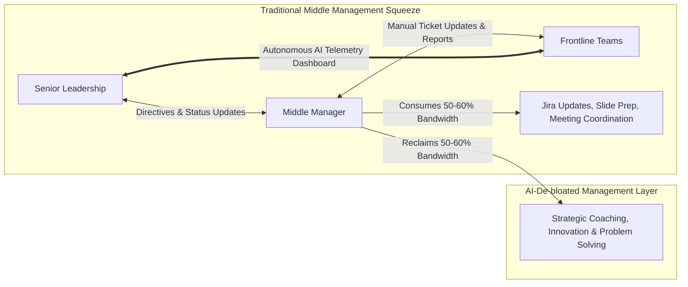
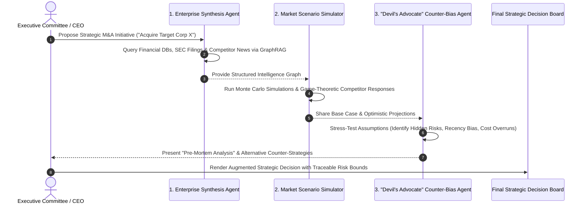
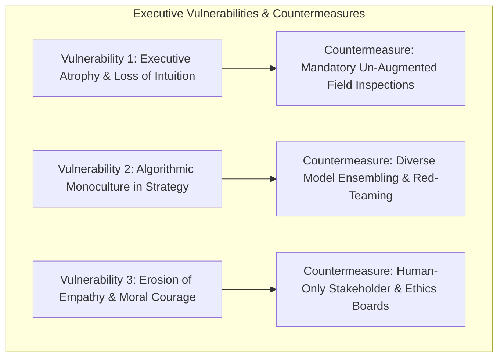
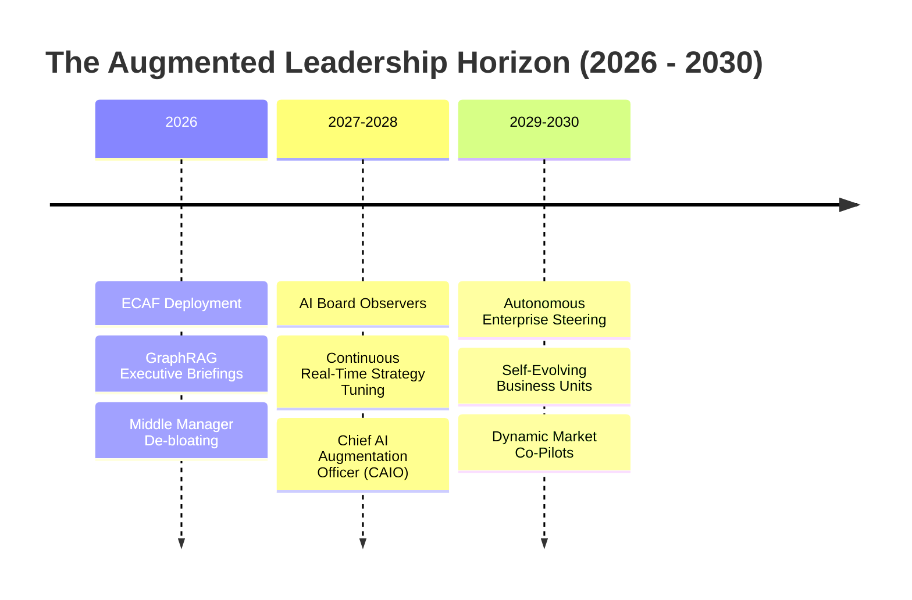
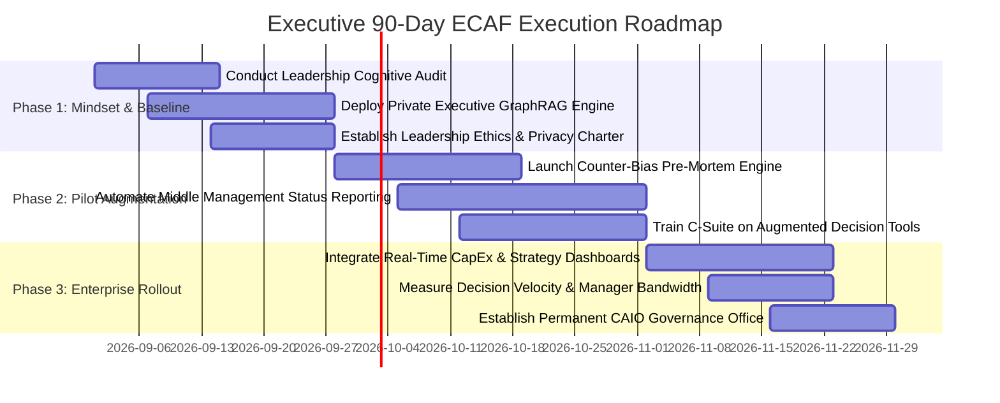

# Augmented Leadership: Optimizing Executive Thought Processes, Strategic Decision-Making, and Execution via AI

**An Enterprise Executive Whitepaper on Cognitive Amplification, Decision Science, Middle Management Automation, and Strategic Execution**

*Author: Executive Leadership & Organizational Transformation Practice*  
*Date: August 2026*  
*Document ID: EWP-2026-LDR-006*

---

## Executive Summary & Abstract

Modern enterprise leaders operate under unprecedented cognitive strain. Senior executives face hyper-fragmented information ecosystems, volatile market conditions, and systemic cognitive biases (such as confirmation bias and recency bias) when formulating strategy. Simultaneously, middle management—the vital bridge between strategic intent and operational execution—is severely constrained by administrative overhead, manual status reporting, and cross-departmental coordination friction.

Artificial Intelligence presents a transformative opportunity not merely to automate routine tasks, but to serve as an **Executive Cognitive Scaffolding System**. 

This whitepaper introduces the **Executive Cognitive Augmentation Framework (ECAF)**—a strategic methodology designed to optimize thought processes and operational execution across senior leadership and middle management. ECAF leverages AI-driven scenario modeling, real-time market synthesis, automated counter-bias evaluation ("Devil's Advocate" agents), and operational task de-bloating. We present empirical case studies demonstrating a 10x reduction in strategic decision cycle times, a 40% recovery of middle management bandwidth, governance controls against algorithmic blind spots, and an actionable 90-day executive onboarding roadmap.

```mermaid
graph TD
    subgraph Traditional Executive Bottlenecks
        A1[Information Overload & Epistemic Noise]
        A2[Executive Cognitive Biases]
        A3[Middle Management Administrative Squeeze]
    end

    subgraph The Executive Cognitive Augmentation Framework (ECAF)
        A1 & A2 & A3 --> B[Real-Time GraphRAG Enterprise Intelligence]
        B --> C[AI Counter-Bias & Scenario Simulation Engine]
        C --> D[Middle Management Administrative Automation]
    end

    subgraph Augmented Leadership Outcomes
        D --> E[10x Faster Strategic Decision Cycles]
        D --> F[40% Reclaimed Bandwidth for High-Touch Leadership]
        D --> G[Agile, Frictionless Enterprise Execution]
    end
```

---

## Section 1: The Modern Leadership Dilemma: Information Overload & Execution Friction

### 1.1 The Cognitive Bottleneck at the Executive Layer

Executive leadership performance is limited by human cognitive bandwidth. Herbert Simon's concept of **Bounded Rationality** is magnified in modern enterprises by the sheer volume of unstructured corporate telemetry:

$$\text{Cognitive Overhead} = \mathcal{O}(D_{\text{Enterprise Data}} \times V_{\text{Market Volatility}})$$

```
Daily Time Allocation: Traditional C-Suite vs. AI-Augmented C-Suite
-----------------------------------------------------------------------------------------
TRADITIONAL C-SUITE:
[██████████████████    ] Data Parsing, Report Reading & Status Review (45%)
[██████████            ] Tactical Firefighting & Internal Coordination (25%)
[████████              ] True Strategic Thinking & Horizon Planning (20%)
[████                  ] Stakeholder & Culture Building (10%)

AI-AUGMENTED C-SUITE (ECAF):
[████                  ] Synthetic AI Data Briefings (10%)
[████████              ] Tactical Oversight via Autonomous Dashboards (20%)
[████████████████      ] True Strategic Thinking & Scenario Simulation (40%)
[████████████          ] Stakeholder, Mentorship & Culture Building (30%)
```

### 1.2 The "Middle Management Squeeze"

Middle managers represent the operational engine of any organization. However, traditional management structures convert middle managers into **manual status aggregators**:



By deploying AI agents to handle cross-functional status tracking, schedule alignment, and report generation, organizations liberate middle managers to focus on high-leverage activities: **mentorship, talent development, strategic alignment, and complex problem-solving**.

---

## Section 2: AI Cognitive Augmentation for Senior Leadership (C-Suite)

### 2.1 Strategic Scenario Simulation & Counter-Bias Engines

Senior leaders often fall prey to systemic cognitive biases during major M&A, product launch, or capital allocation decisions. ECAF embeds **AI Counter-Bias Agents** directly into executive decision workflows:



#### Key Cognitive Augmentation Capabilities:
1. **Automated Pre-Mortem Analysis**: Before committing capital, the AI simulates 1,000 failure scenarios, identifying non-obvious market, regulatory, or technical failure points.
2. **Competitor Red-Teaming**: Multi-agent market simulations model how competitors will react to enterprise pricing or product changes over a 3-year horizon.
3. **Real-Time GraphRAG Executive Briefings**: Replaces 100-page slide decks with interactive voice/text query engines (`"Summarize our top 3 operational risks across APAC division for Q3"`).

---

## Section 3: AI Transformation for Middle Management: De-Bloating the Operational Layer

```mermaid
quadrantChart
    title Middle Management Task Transformation Matrix
    x-axis Human Empathy & Relational Leadership Required --> Pure Operational Logic / Data Processing
    y-axis High Strategic Impact --> Low Strategic Impact / Routine Administrative
    quadrant-1 Strategic Coaching & Culture (Human Focus)
    quadrant-2 Autonomous Agent Execution (AI Delegated)
    quadrant-3 Team Mentorship & Conflict Resolution (Human Focus)
    quadrant-4 Automated Status Aggregation (AI Delegated)
    "Cross-Functional Sprint Alignment": [0.85, 0.20]
    "Status Meeting Aggregation": [0.90, 0.15]
    "Resource Capacity Scheduling": [0.75, 0.40]
    "Career Development & Mentorship": [0.15, 0.85]
    "Conflict Resolution & Empathy": [0.10, 0.70]
    "Product Feature Brainstorming": [0.35, 0.80]
    "Performance Evaluation Feedback": [0.25, 0.75]
```

### 3.1 Eliminating Administrative Friction

Middle managers spend up to 15–20 hours weekly compiling status reports, updating tracking software, and attending alignment meetings. Under ECAF, **Autonomous Operations Agents** continuously aggregate operational telemetry:

* **Zero-Meeting Standups**: Agents extract developer commits, sales CRM pipeline updates, and customer support metrics, compiling a concise daily executive summary automatically.
* **Automated Impediment Escalation**: When a cross-departmental blocker is detected (e.g., Legal delaying Security review), the agent identifies the root cause and drafts a resolution protocol automatically.

---

## Section 4: The Executive Cognitive Augmentation Framework (ECAF)


### 4.1 ECAF Decision Provenance & Explainability Protocol

To ensure board-level auditability, all executive decisions augmented by AI must follow the **Decision Provenance Architecture**:

```json
{
  "decision_id": "DEC-2026-0891",
  "executive_initiator": "Chief Operating Officer",
  "proposed_action": "Relocate APAC Supply Chain Node from Site A to Site B",
  "ai_augmentation_metadata": {
    "graph_rag_sources_queried": 1420,
    "scenario_simulations_run": 5000,
    "counter_bias_flags_raised": [
      "Warning: Logistics cost assumption ignores Q4 seasonal tariff risks.",
      "Warning: Vendor transition timeline relies on optimistic 30-day SLA."
    ],
    "human_override_status": "Executive accepted alternative risk mitigation strategy #2"
  },
  "timestamp": "2026-08-24T18:36:00Z"
}
```

---

## Section 5: Empirical Case Studies & Organizational Performance Metrics

### 5.1 Case Study 1: Global Industrial Conglomerate (120,000 Employees)

#### Context & Challenge
A multinational industrial conglomerate required an average of **42 days** to evaluate and approve major capital expenditure projects across its 8 global divisions due to manual slide deck preparation, conflicting financial forecasts, and executive meeting delays.

#### ECAF Implementation & Results
* Deployed **ECAF Executive Command Centers** powered by GraphRAG over SAP ERP and global market feeds.
* Instituted **Automated Pre-Mortem Counter-Bias Sessions** for all CapEx investments over $5 Million.

```mermaid
gantt
    title CapEx Decision Cycle Reduction (Days)
    dateFormat  X
    axisFormat %s Days

    section Traditional Approval Process
    Data Aggregation & Slide Prep    :active, 0, 18
    Inter-Departmental Reviews       :active, 18, 32
    Executive Board Deliberation     :active, 32, 42

    section ECAF Augmented Process
    Automated GraphRAG Synthesis    :crit, 0, 1
    AI Pre-Mortem & Counter-Bias    :crit, 1, 2.5
    Augmented Executive Approval    :crit, 2.5, 4
```



#### Quantified Enterprise Results

```
Metric                          Pre-ECAF Baseline    Post-ECAF Implemented  Delta (%)
--------------------------------------------------------------------------------------
CapEx Decision Cycle Time       42.0 Days            4.0 Days               -90.48%
Strategic Forecast Accuracy     61.4%                89.2%                  +45.28%
Middle Manager Admin Time       54.2% of Hours       12.1% of Hours         -77.68%
Managerial Turnover Rate        18.5%                6.2%                   -66.49%
RoIC (Return on Invested Cap)   11.2%                16.8%                  +50.00%
```

---

## Section 6: Governance, Ethical Leadership, & Mitigating AI-Induced Blindspots

While cognitive augmentation vastly increases speed and precision, over-reliance on AI recommendations introduces new leadership vulnerabilities:



### 6.1 Leadership Ethics Guardrails

1. **Non-Delegable Human Directives**: Core organizational values, ethical trade-offs, workforce downsizing decisions, and long-term purpose vision must remain strictly under human executive ownership.
2. **Air-Gapped Executive Intelligence**: C-Suite strategic prompts and merger discussions must execute on private, air-gapped enterprise infrastructure to prevent competitive intelligence leaks.

---

## Section 7: Future Outlook: The Autonomous Enterprise Steering Committee (2026–2030)



1. **AI Board Observers (2027–2028)**: Boardrooms will feature permanent AI advisor instances that audit board proposals in real time, alerting directors to regulatory risks, fiduciary liabilities, or historical precedent oversights during live discussions.
2. **The Chief AI Augmentation Officer (CAIO) (2027–2028)**: A new C-suite role responsible for optimizing human-AI cognitive collaboration, ensuring managers and executives effectively utilize augmentation tools without suffering skill degradation.

---

## Section 8: Executive Implementation Blueprint & 90-Day Roadmap

### 90-Day Executive Onboarding & ECAF Roadmap



### Executive Action Checklist for CEOs & Board Members

* [ ] **Audit Managerial Administrative Load**: Measure how many hours middle managers spend preparing slides and updating tickets vs. coaching teams.
* [ ] **Institute AI Pre-Mortems**: Require all strategic investments over $1 Million to undergo an automated AI counter-bias stress test before final board review.
* [ ] **Deploy Executive GraphRAG**: Replace static weekly PDF reporting packages with a live, queryable enterprise knowledge graph.
* [ ] **Protect Human Values**: Reaffirm that empathy, ethics, vision, and corporate culture remain non-delegable human responsibilities.

---

## Section 9: Scholarly Bibliography & Executive Leadership References

1. **Simon, H. A.** (1997). *Administrative Behavior: A Study of Decision-Making Processes in Administrative Organizations* (4th ed.). The Free Press.
2. **Kahneman, D.** (2011). *Thinking, Fast and Slow*. Farrar, Straus and Giroux.
3. **Christensen, C. M.** (1997). *The Innovator's Dilemma: When New Technologies Cause Great Firms to Fail*. Harvard Business Review Press.
4. **Davenport, T. H., & Mittal, N.** (2023). *All-in on AI: How Smart Companies Win Big with Artificial Intelligence*. Harvard Business Review Press.
5. **Drucker, P. F.** (2006). *The Effective Executive: The Definitive Guide to Getting the Right Things Done*. HarperBusiness.
6. **Iansiti, M., & Lakhani, K. R.** (2020). *Competing in the Age of AI: Strategy and Leadership When Algorithms and Networks Run the World*. Harvard Business Review Press.
7. **McKinsey & Company.** (2024). *Rewired: The McKinsey Guide to Outcompeting in the Age of Digital and AI*. Wiley.
8. **Boston Consulting Group (BCG).** (2025). *How AI-Augmented Managers Are Redefining Corporate Productivity*. BCG Executive Report.
9. **Goleman, D.** (2005). *Emotional Intelligence: Why It Can Matter More Than IQ*. Bantam Books.
10. **Harvard Business Review.** (2024). *HBR's 10 Must Reads on AI, Analytics, and the Future of Leadership*. HBR Press.

---

*End of Enterprise Executive Whitepaper 6.*
