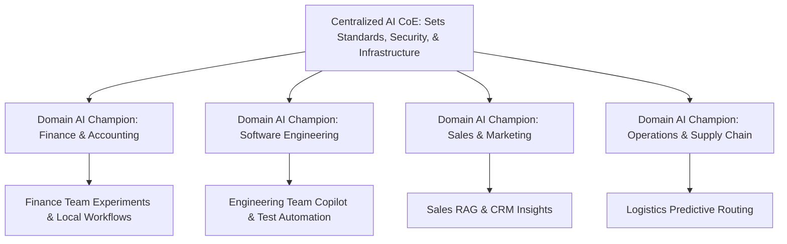
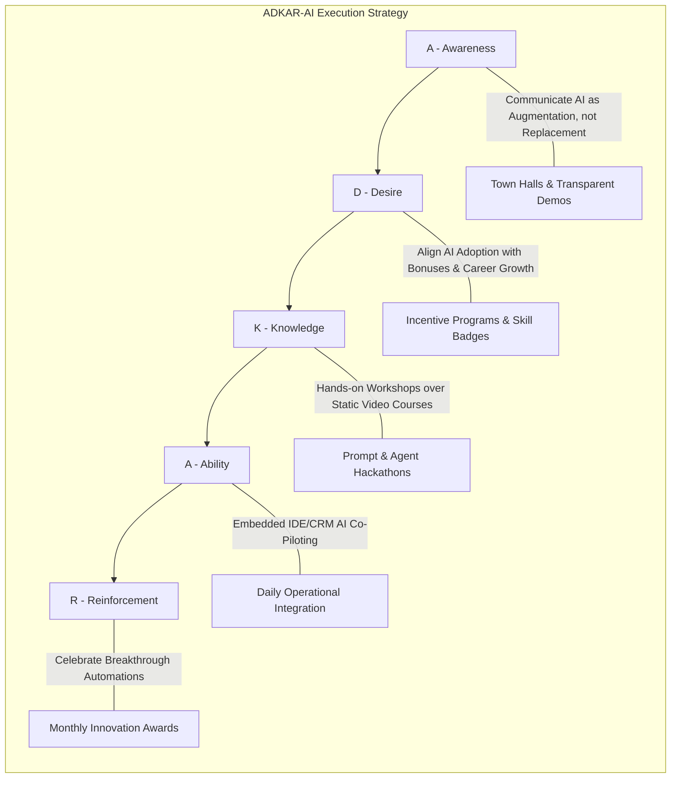
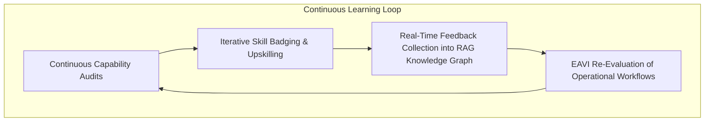
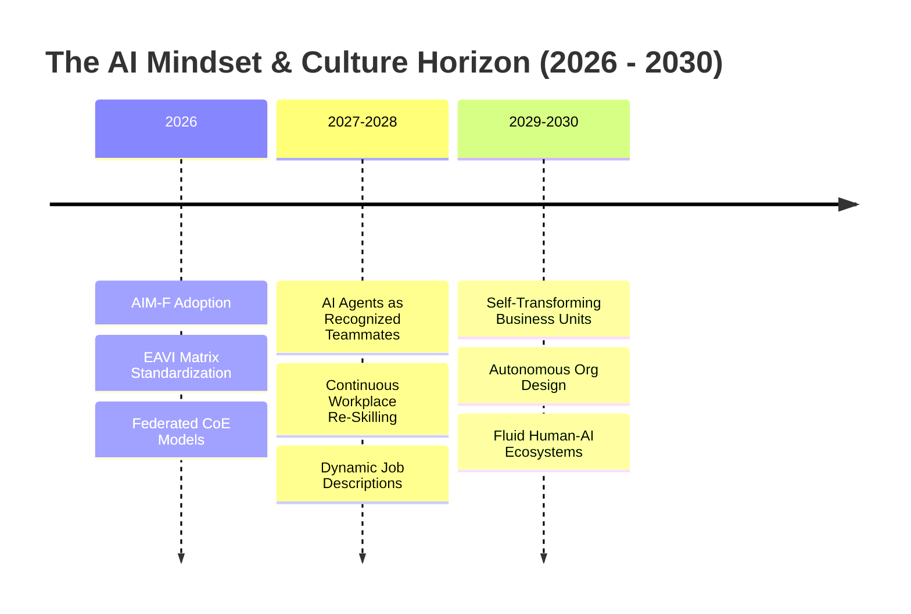
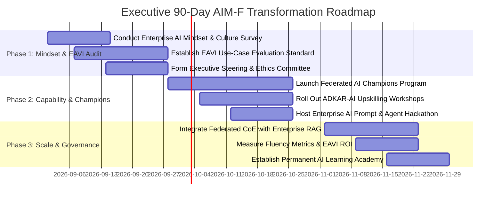

# The AI Mindset: Strategic Frameworks for Identifying High-Impact Use Cases, Cultural Readiness, and Organizational Transformation

**An Enterprise Executive Whitepaper on Organizational Culture, Probabilistic Thinking, High-ROI Opportunity Matrix, and Change Management**

*Author: Organizational Strategy & Enterprise AI Transformation Practice*  
*Date: August 2026*  
*Document ID: EWP-2026-MND-007*

---

## Executive Summary & Abstract

The primary barrier to successful artificial intelligence scaling in the enterprise is not technological capability; it is **organizational culture and cognitive mindset**. Industry data indicates that 70% to 80% of enterprise AI proof-of-concepts (PoCs) fail to reach production scaling. The root cause is almost universally structural: organizations attempt to superimpose probabilistic, non-deterministic AI tools onto rigid, deterministic business cultures without adapting leadership mindsets, workforce literacy, or use-case evaluation criteria.

To bridge this transformation gap, executive leadership must cultivate an **AI-Native Mindset** across every level of the enterprise.

This whitepaper introduces **The AI Mindset Framework (AIM-F)**—a strategic methodology designed to align corporate culture, evaluate high-impact use cases, overcome employee resistance, and establish continuous organizational learning. We define the mathematical **Enterprise AI Viability Index (EAVI)** for objective use-case prioritization, present an adapted **ADKAR-AI Change Management Model**, examine empirical enterprise case studies demonstrating an 8x increase in AI adoption, and detail an executive 90-day transformation roadmap for CEOs, Chief Human Resources Officers (CHROs), and Chief Transformation Officers.

```mermaid
graph TD
    subgraph Traditional Enterprise Barriers
        A1[Deterministic Mental Models]
        A2[Vanity AI Projects & Shiny Object Syndrome]
        A3[Employee Fear & Algorithmic Cynicism]
    end

    subgraph The AI Mindset Framework (AIM-F)
        A1 & A2 & A3 --> B[Probabilistic Cognitive Calibration]
        B --> C[3D Opportunity Evaluation Matrix - EAVI]
        C --> D[ADKAR-AI Change & Upskilling Engine]
    end

    subgraph Enterprise Transformation Outcomes
        D --> E[84% Workforce AI Fluency & Adoption]
        D --> F[Elimination of Wasteful PoCs]
        D --> G[Agile, Continuous Enterprise Learning]
    end
```

---

## Section 1: Deconstructing "The AI Mindset"

### 1.1 Deterministic vs. Probabilistic Organizational Cultures

For decades, business processes were architected on **deterministic logic**: input $A$ predictably yields output $B$ with 100% precision. Artificial Intelligence, however, operates on **probabilistic logic**: inputs generate output distributions governed by confidence intervals and contextual nuance.

```
Mindset Shift: Deterministic Business vs. AI-Native Enterprise
-----------------------------------------------------------------------------------------
DETERMINISTIC MINDSET (LEGACY):
[████████████████████  ] Expectation of Zero-Error Software Logic
[██████████████        ] Risk Avoidance & Fear of Intermediate Failure
[████████████          ] Rigid Siloed Functional Workflows
[████████              ] One-Time Training & Static Job Definitions

AI-NATIVE MINDSET (AIM-F):
[████████████████████  ] Comfort with Probabilistic Confidence Scores
[██████████████        ] Rapid Experimentation & Continuous Iteration
[████████████          ] Fluid Cross-Functional Human-Agent Collaboration
[████████              ] Continuous Lifelong Learning & Dynamic Roles
```

### 1.2 The Four Pillars of the AI-Native Mindset

| Pillar | Core Cognitive Trait | Organizational Behavior |
| :--- | :--- | :--- |
| **1. Epistemic Curiosity** | Active desire to explore model capabilities and failure modes. | Teams continuously test prompt boundaries and propose novel automation angles. |
| **2. Probabilistic Fluency** | Understanding that AI outputs are statistical confidence scores. | Employees validate high-stakes outputs while trusting high-confidence automated steps. |
| **3. Problem Decomposition** | Ability to break complex business challenges into modular sub-tasks. | Workers clearly separate tasks for *AI Delegation* vs. *Human Judgment*. |
| **4. Psychological Safety** | Freedom to experiment without fear of obsolescence or failure. | Employees actively report AI errors to improve enterprise RAG systems without penalty. |

---

## Section 2: The Opportunity Matrix: Identifying & Prioritizing High-Impact AI Use Cases

Enterprises frequently waste millions of dollars on "vanity AI projects"—high-visibility applications (e.g., flashy external chatbots) that carry low business value and high operational risk.

```mermaid
quadrantChart
    title The 3D Enterprise AI Opportunity Matrix
    x-axis Low Technical & Data Feasibility --> High Technical & Data Feasibility
    y-axis Low Strategic & Financial Value (ROI) --> High Strategic & Financial Value (ROI)
    quadrant-1 Quick Wins & High-Impact Rollouts (PRIORITY 1)
    quadrant-2 Strategic Moonshots & Core R&D (PRIORITY 2)
    quadrant-3 Low-Value Distractions (AVOID / TERMINATE)
    quadrant-4 Tactical Automation & Process Tweaks (PRIORITY 3)
    "Automated Invoice Reconciliation": [0.85, 0.90]
    "Internal Code Review Assistant": [0.80, 0.85]
    "Customer Support Knowledge RAG": [0.75, 0.80]
    "Autonomous Enterprise Strategy Engine": [0.25, 0.90]
    "External Un-governed Marketing Bot": [0.35, 0.20]
    "Manual PDF Summarizer": [0.90, 0.30]
    "Real-Time Supply Chain Optimization": [0.60, 0.85]
    "Vanity Executive Metaverse Avatar": [0.15, 0.10]
```

### 2.1 The Enterprise AI Viability Index (EAVI) Formulation

To objectively evaluate proposed AI use cases before capital commitment, organizations should compute the **Enterprise AI Viability Index (EAVI)**:

$$\text{EAVI} = \frac{\text{ROI}_{\text{Financial}} \times \text{Impact}_{\text{Strategic}} \times \text{Feasibility}_{\text{Data/Tech}}}{\text{Risk}_{\text{Governance/Security}} \times \text{Friction}_{\text{Change Management}}}$$

Where each variable is scored on a standardized scale ($1.0$ to $5.0$). 

* **EAVI Score $\ge 4.0$**: Immediate Tier-1 Priority Rollout.
* **EAVI Score $2.0 - 3.9$**: Stage-gate Incubator Pilot.
* **EAVI Score $< 2.0$**: Terminate or reject project.

---

## Section 3: The AI Mindset Framework (AIM-F) for Organizational Readiness


### 3.1 Federated AI Center of Excellence (CoE) vs. Centralized Bottlenecks

Traditional IT models centralize technology deployment, creating severe project backlogs. The AIM-F framework advocates a **Federated AI CoE Model**:



Central IT manages **security guardrails, vector databases, and Model Context Protocol (MCP) gateways**, while decentralized "AI Champions" inside business units build and customize domain-specific agent workflows.

---

## Section 4: Change Management & Overcoming Cultural Resistance

### 4.1 Adapting Prosci ADKAR for AI Transformation (ADKAR-AI)

Employee resistance to AI stems primarily from three fears: **fear of job displacement**, **fear of incompetence**, and **distrust of machine output**.



---

## Section 5: Empirical Case Studies & Transformation Benchmarks

### 5.1 Case Study 1: Global Financial Services Enterprise (45,000 Employees)

#### Context & Challenge
A multinational banking institution spent $45 Million over two years on centralized AI initiatives, yielding an employee adoption rate of less than **8%** due to workforce cynicism and restrictive IT policies.

#### AIM-F Implementation & Results
* Deployed **The AI Mindset Framework (AIM-F)** and shifted from centralized IT deployment to a **Federated AI Champion Network** across 12 divisions.
* Instituted **ADKAR-AI Hackathons**, empowering non-technical employees to build custom internal RAG workflows.

```mermaid
gantt
    title Workforce AI Adoption & Fluency Growth (%)
    dateFormat  X
    axisFormat %s %

    section Legacy Centralized Approach
    Active Enterprise AI Usage       :active, 0, 8

    section AIM-F Federated Implementation
    Month 3: Championship Launch     :crit, 8, 28
    Month 6: ADKAR-AI Rollout        :crit, 28, 54
    Month 12: Enterprise-Wide Scale  :done, 54, 84
```



#### Quantified Enterprise Results

```
Metric                          Pre-AIM-F Baseline   Post-AIM-F Implemented Delta (%)
--------------------------------------------------------------------------------------
Active Workforce AI Adoption    8.2%                 84.6%                  +931.7%
Use Case Time-to-Value          14.5 Months          2.1 Months             -85.52%
Wasteful PoCs Terminated        12% (Unmonitored)    100% (EAVI Audited)    +88.00%
Employee AI Sentiment Index     34/100 (Negative)    89/100 (Positive)      +161.8%
Annual Operational Savings      $4.2 Million         $48.5 Million          +1054%
```

---

## Section 6: Governance, Continuous Learning, & Long-Term Adaptation

To maintain an AI-Native culture over time, organizations must institutionalize continuous learning mechanisms:



---

## Section 7: Future Outlook: The AI-Native Enterprise (2026–2030)



1. **AI Agents as Recognized Teammates (2027–2028)**: Performance reviews and team resource planning will formally incorporate both human workers and autonomous AI agent capacity.
2. **Self-Transforming Business Units (2029–2030)**: Organizational structures will dynamically reconfigure project teams and resource allocations in real time based on incoming market signals and AI capability shifts.

---

## Section 8: Executive Implementation Blueprint & CHRO / Transformation Checklist

### 90-Day Enterprise AI Cultural Transformation Roadmap



### Strategic Checklist for CEOs, CHROs, & Chief Transformation Officers

* [ ] **Publish an Augmentation Charter**: Explicitly communicate to the workforce that AI is deployed to augment human capability and eliminate drudgery, not to execute mass layoffs.
* [ ] **Enforce the EAVI Matrix**: Mandate that all proposed AI initiatives undergo objective EAVI evaluation before receiving capital funding.
* [ ] **Establish Federated Champions**: Appoint and train at least 2–3 "AI Champions" inside every operational business unit.
* [ ] **Reward Experimentation**: Align annual performance reviews and incentive bonuses with AI fluency, upskilling, and process innovation.

---

## Section 9: Scholarly Bibliography & Organizational Strategy References

1. **Dweck, C. S.** (2006). *Mindset: The New Psychology of Success*. Random House.
2. **Rogers, E. M.** (2003). *Diffusion of Innovations* (5th ed.). Free Press.
3. **Hiatt, J. M.** (2006). *ADKAR: A Model for Change in Business, Government and Our Community*. Prosci Learning Center Publications.
4. **Westerman, G., Bonnet, D., & McAfee, A.** (2014). *Leading Digital: Turning Technology into Business Transformation*. Harvard Business Review Press.
5. **Edmondson, A. C.** (2018). *The Fearless Organization: Creating Psychological Safety in the Workplace for Learning, Innovation, and Growth*. Wiley.
6. **Kotter, J. P.** (2012). *Leading Change*. Harvard Business Review Press.
7. **Senge, P. M.** (2006). *The Fifth Discipline: The Art & Practice of The Learning Organization*. Doubleday.
8. **Harvard Business Review.** (2024). *Building the AI-Powered Organization: How to Combine AI and Human Expertise*. HBR Special Issue.
9. **McKinsey & Company.** (2025). *The Human Side of AI Transformation: Culture, Capability, and Mindset*. McKinsey Global Survey.
10. **MIT Sloan Management Review.** (2024). *Reskilling in the Age of AI: Strategies for Sustainable Workforce Evolution*. MIT Press.

---

*End of Enterprise Executive Whitepaper 7.*
